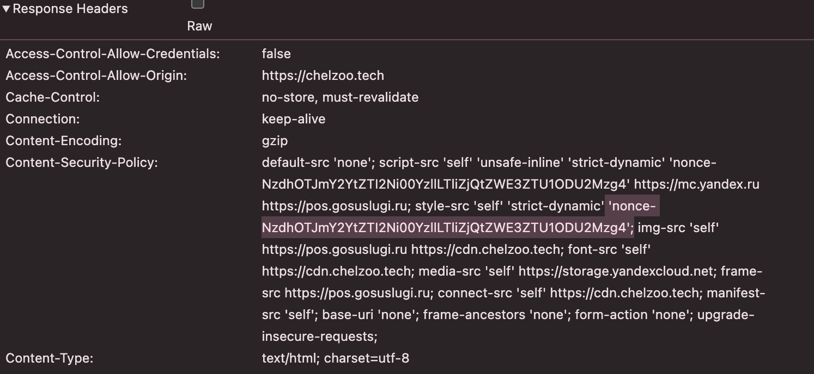
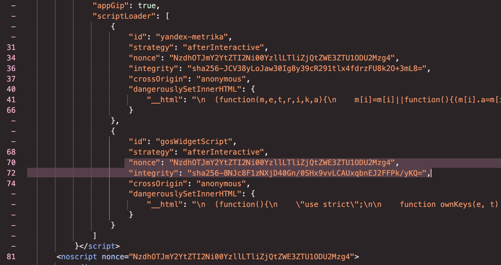
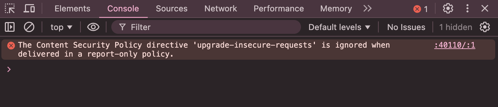

# Content Security Policy

#### Статус
Принято

## Контекст
Content Security Policy (CSP) — это механизм защиты, реализуемый через HTTP-заголовок Content-Security-Policy. Он позволяет указать, какие источники контента разрешены на странице. Это помогает предотвратить ряд атак, таких как XSS (Cross-Site Scripting) или загрузка вредоносных ресурсов.  

#### Цель CSP:
- Предотвратить выполнение вредоносных скриптов, которые могут быть внедрены на страницу. Например: Если CSP настроен так, что разрешены только скрипты с определенного домена (script-src 'self' https://trusted-scripts.com), то любые попытки выполнить скрипты из других источников будут заблокированы.

- Обеспечить доверенность загружаемого контента, контролируя источники для загрузки ресурсов (скриптов, стилей, изображений и т.д.). Например: Директива img-src 'self' https://trusted-images.com позволяет загружать изображения только с вашего домена и с доверенного сервиса. С неразрешенных источников загрузка изображений будет запрещена.

#### Список директив:
- **default-src** — источник по умолчанию для всех типов ресурсов, кроме base-uri, frame-ancestors и form-action

- **script-src** — источники для загрузки скриптов

- **style-src** — источники для загрузки стилей

- **img-src** — источники для загрузки изображений

- **connect-src** — источники, к которым разрешено устанавливать соединения (например, для AJAX-запросов)

- **font-src** — источники для загрузки шрифтов

- **object-src** — источники, из которых разрешено загружать объекты (например, Flash)

- **media-src** — источники для загрузки медиафайлов (аудио и видео)

- **frame-src** — источники, из которых разрешено загружать фреймы

- **child-src** — источники для создания дочерних ресурсов (например, для worker и frame)

- **manifest-src** — источники для загрузки манифестов приложений

- **worker-src** — источники для веб-воркеров и сервис-воркеров

- **base-uri** — допустимые источники для элемента `<base>`

- **form-action** — указывает, куда разрешено отправлять формы

- **frame-ancestors** — какие источники могут встраивать текущую страницу в фрейм

#### Допустимые значения директив:
- **'self'** — разрешает загрузку ресурсов только с того же источника (домена)

- **'none'** — запрещает загрузку ресурсов из любого источника

- **'unsafe-inline'** - разрешает выполнение встроенных скриптов или стилей. Использовать с осторожностью, так как это увеличивает риск XSS.

- **'unsafe-eval'** — разрешает выполнение строковых скриптов, например, с помощью [eval()](https://developer.mozilla.org/en-US/docs/Web/JavaScript/Reference/Global_Objects/eval). Также следует использовать с осторожностью.

- **URL-адреса** - Полные URL-адреса (например, https://example.com), которые указывают на разрешенные источники

Во время разработки и настройки CSP хорошей практикой считается использование заголовка Content-Security-Policy-Report-Only вместо Content-Security-Policy, чтобы отлавливать нарушения и понять, что ещё работает небезопасно, прежде чем включать жёсткую политику с блокировкой контента.

Основной сложностью в CSP-репорте являлось использование небезопасных значений:
- 'unsafe-inline' — разрешает любые встроенные скрипты и стили

- 'unsafe-eval' — разрешает eval()

Избавиться от этих небезопасных значений можно, только если отказаться от инлайн-элементов, но они присутствуют в HTML и необходимы для корректной работы некоторых компонентов. Например, скрипты госуслуг и яндекс метрик, а также инлайн стили лоадера, добавленнные в _document.tsx для моментального отображения лоадера.

## Решение
Самое распространненое и эффективное решение — внедрение nonce или hash:
- **nonce** — уникальный код, генерируемый на каждый запрос к странице, добавляется в заголовок и на элементы на странице

- **hash** — хэш содержимого скрипта, если он не меняется

### Nonce
Для нашего кейса идеальным стало использование **nonce**.

Суть в том, что только элементы с корректным nonce будут выполнены — злоумышленник не сможет предугадать/подделать значение.

Сначала пробовали задавать заголовки CSP на уровне next.config.js, то есть на этапе сборки - захардкодили nonce и поняли, что это неверное решение, потому что он должен быть динамическим — разным на каждый запрос, а не генерироваться только единоразово на этапе сборки.

Мы добавили файл middleware.ts в src/, реализующий динамическую генерацию nonce и установку CSP-заголовка. Пример реализации взят из:
- [официальной документации Next.js](https://nextjs.org/docs/app/guides/content-security-policy)
- [доклада на конференции React Summit](https://gitnation.com/contents/content-security-policy-with-nextjs-leveling-up-your-websites-security/video)

Этот middleware:
1) генерирует nonce
2) вставляет его в CSP-заголовок
3) передает его через Request Headers
4) доступен в компонентах для использования в скриптах и стилях

Далее мы внедрили сгенерированный **nonce** в теги скриптов и стилей, встроенных в HTML в файле _document.tsx
После этого удалили значения 'unsafe-inline' и 'unsafe-eval', но по советам Lighthouse и документации пришлось оставить значение 'unsafe-inline' для script-src в прод версии, на случай, если устаревшие браузеры не будут поддерживать подход с nonce и без него элементы не смогут отобразиться. В современных браузерах **unsafe-inline**, прописанная рядом с  **nonce** вместе со **strict-dynamic**, игнорируется и не создает дыр в безопасности.

После устранения проблем из отчета Content-Security-Policy-Report-Only мы перешли на хэдер Content-Security-Policy.

### Hash
Также мы внедрили еще и использование **hash** для дополнительной защиты от изменения наших скриптов, т.к. nonce разрешает использования скриптов со сторонних ресурсов, но если их взломают и изменят передаваемый скрипт, только hash поможет это обнаружить.

Решили генерировать хэши внутри нашего кода и добавили утилиту `getHash.ts`, в которой прописали функцию хэширования контента. Эту функцию мы вызываем в файле _document.tsx и передаем в нее скрипты госуслуг и яндекс метрики для получения хэша. Сгенерированный хэш уже добавляем к атрибуту `<script>` в параметр `integrity`. Например:

```bash
<Script
id="yandex-metrika"
strategy="afterInteractive"
nonce={nonce}
integrity={YMetricHash} // сгенерированный хэш
crossOrigin="anonymous"
dangerouslySetInnerHTML={{
    __html: YMetricScript, // сам скрипт
}}
/>
```

Также к атрибуту `<script>` добавили параметр `crossOrigin="anonymous"`, который идет в паре с `integrity` и разрешает загрузку ресурсов с других ориджинов без отправления учетных данных, куки и т.д.

### Как выглядят добавленные nonce и hash в браузере

Так в DevTools выглядит nonce, добавленный в заголовок


Так выглядят nonce и hash в HTML страницы


### Тестирование

Для тестирования рассматриваем реализацию теста, который выставляет хэддер Content-Security-Policy-Report-Only и проверяет отчет на наличие замечаний.   
Существует небольшая проблема в реализации из-за директивы    [upgrade-insecure-requests](https://developer.mozilla.org/en-US/docs/Web/HTTP/Reference/Headers/Upgrade-Insecure-Requests) в CSP хэддерах, которая сообщает браузеру автоматически заменять все HTTP-запросы на HTTPS-запросы.   
Content-Security-Policy-Report-Only выводит ошибку-предупреждение


Данная ошибка сообщает, что занный заголовок игнорируется, так как заголовок Content-Security-Policy-Report-Only не должен изменять поведение браузера, а лишь служит для мониторинга нарушений. 

Решением является удаление директивы upgrade-insecure-requests из CSP-заголовка Content-Security-Policy-Report-Only на время тестирования.

## Альтернативы
Не рассматривали.

## Последствия
- CSP влияет на внешние библиотеки: сторонние скрипты, виджеты могут перестать работать, если их явно не разрешить

- Требуется дополнительная поддержка при изменении структуры HTML или появлении новых инлайн-элементов

## Плюсы
- Существенно повысили безопасность

- Контроль над используемыми ресурсами и выполняемым кодом

## Минусы
- Увеличение сложности конфигурации

- Потребовалось много времени для настройки и рефакторинга
 
### Ссылка на PR
https://github.com/TourmalineCore/pelican-ui/pull/345
