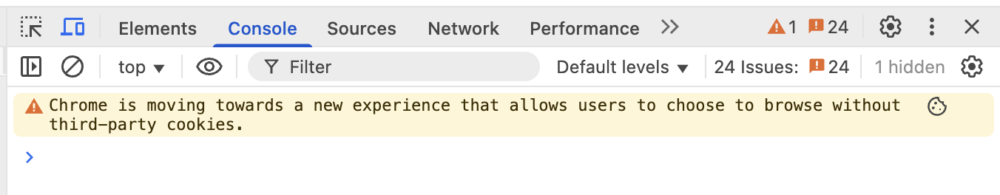
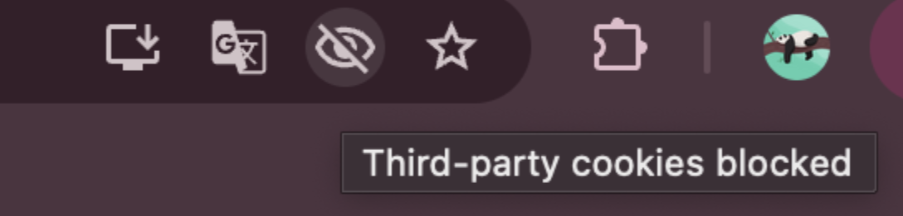

# Third-party cookies

#### Статус
Предложено

## Контекст
После добавление баннера госуслуг, сайт начал отображать предупреждение в консоли браузера Google Chrome:

Это связано с постепенным отказом Chrome от third-party cookies в рамках инициативы Privacy Sandbox, данный вид куки создается, когда сайт загружает сторонний скрипт и он устанавливает cookie с другого домена.

Проблема заметна в Chrome, где предупреждение может регистрироваться много раз подряд и раздражать разработчиков.

На нашем сайте third-party cookies устанавливаются внешними скриптами:

- Яндекс.Метрика

- Виджет Госуслуг (pos.gosuslugi.ru)

Оба скрипта подключаются в файле next/_document.tsx с помощью dangerouslySetInnerHTML, что ограничивает контроль над тем, как они работают с cookie.

## Решение
На текущий момент мы оставляем всё как есть, по следующим причинам:

- Скрипты используются для выполнения важных задач: аналитика и интеграция с государственными сервисами.

- Предупреждение не влияет на работоспособность сайта.

- Внешние скрипты находятся вне зоны нашего контроля.

- Мы не наблюдаем функциональных проблем из-за этого предупреждения.

## Альтернативы

### 1. Блокировка third-party cookies в браузере
Основное решение, которое предложило сообщество и [официальная документация](https://privacysandbox.google.com/cookies/prepare/overview): 

1. On your computer, open Chrome.
2. At the top right, select More Settings.
3. Select Privacy and security. Third-party cookies.
4. Select an option: Block third-party cookies.

Данное решение подключает в браузере функцию управления third-party cookies на сайтах, где они присутствуют и убирают предупреждения. Можно их заблокировать и проверить работоспособность сайта, чтобы убедиться, что глобальная блокировка куки в будущем никак не повлияет на сайт. 

#### Плюсы:
- С помощью [этой настройки](https://privacysandbox.google.com/cookies) смогли проверить сайт на работоспособность при блокировке сторонних куки и удостовериться, что ничего не ломается.

#### Минусы:
- Это будет работать только в том брузере, где это будет сделано. Мы не можем выставить эту настройку глобально для всех пользователей, использующих наш сайт.

### 2. Добавление атрибута SameSite=None
[Данная документация](https://privacysandbox.google.com/cookies/prepare/audit-cookies) предлагает решение по борьбе с third-party cookies в виде добавления атрибута **SameSite=None** для скриптов. Это позволяет браузеру понимать, что куки намеренно используются в контексте стороннего ресурса и соответствуют требованиям безопасности.

#### Плюсы:
- Chrome предлагает данное решение для сохранения важных скриптов, использующих этот вид куки, и соответствия будущим стандартам браузера

- Минимальные изменения при доступе к исходному коду и настройке скриптов

#### Минусы:
- Наши собственные скрипты не используют данный вид куки, их выставляют подключенные скрипты яндекс метрик и госуслуг. Если скрипты яндекса позволяют выставить некоторые параметры для настройки, то скрипт госуслуг (основная проблема) подгружается извне и мы не можем его изменить, если только не захардкодим у себя весь виджет.

## Последствия
- В консоли Chrome по-прежнему будет отображаться предупреждение.

- При масштабной блокировке third-party cookies возможно придется вернуться к этому вопросу (если это произойдет, то это произойдет на всех сайтах, где используюется баннер госуслуг и есть надежды на то, что они сами обновят свой скрипт, который мы подгружаем и который вызывает эту проблему)

## Плюсы
- Сохраняем текущую функциональность без доработок.

## Минусы
- Предупреждение в DevTools.

- Возможные будущие проблемы при масштабной блокировке third-party cookies.