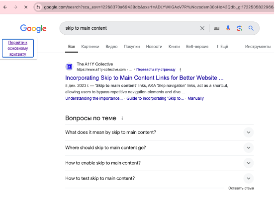
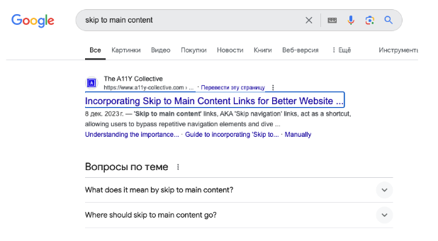
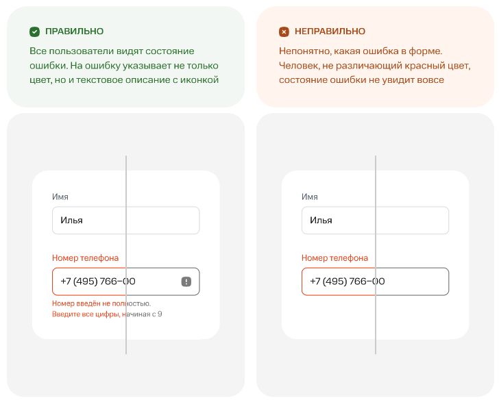
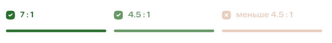

# Гайдлайн

## Взаимодействие с сайтом
* возможность использования скринридера, необходимы правильные подписи ко всем элементам на сайте
* возможность работать с клавиатуры (tab, enter), все интерактивные элементы могут получать видимый фокус
    * Видимый фокус
    * Логичный порядок фокуса
    * Все контролы доступны с клавиатуры
    * Нет мест блокировки клавиатуры (ловушек для фокуса)
    * Можно пропустить навигацию (**skip link**). 
*Кнопка **skip to main content** по умолчанию скрыта, но при первом нажатии клавиши tab становится видимой и в фокусе. Последующее нажатие enter позволяет фокусу перейти сразу к главному контенту, минуя, например, навигацию.*

*Шаг 1. Нажатие tab*

*Шаг 2. Нажатие enter*

## Цвет
* достаточная контрастность
* Не рекомендуется использовать цвет в качестве единственного визуального средства передачи информации или обозначения действия, а стоит комбинировать цвет с другими идентификационными знаками (иконки, пояснительный текст)

## Текст
* Обычный текст и текст на картинках должен иметь контрастность не менее 4.5:1 (Уровень АА), не менее  7:1 (Уровень ААА)

* размер шрифта может быть изменен в пределах 200 процентов нативно в браузере, без появления горизонтального скролла (решается грамотным адаптивом);
* Строка не должна быть длиннее 80 символов (Уровень ААА)
*Старая практика поддерживать 80-символьную длину строки пришла из эпохи маленьких мониторов, когда это должно было сделать код более удобным для чтения, чтобы все содержимое могло уместиться на одном экране. Или, возможно, практика пришла из эпохи перфокарт, которые раньше имели 80-символьную длину.*
* Запрещено выравнивание по ширине (Уровень ААА)
*Выровненный по ширине текст гораздо менее читабелен, чем выровненный по левому краю.  Причина в увеличенных интервалах между словами: глаз постоянно вынужден выискивать начало следующего слова, а из-за разности пробелов от строки к строке еще и перестраиваться с одного расстояния на другое.*
* Межстрочный интервал — как минимум в полтора раза больше размера шрифта;
интервал между абзацами — как минимум в два раза больше размера шрифта;
интервал между буквами составляет как минимум 0.12 от размера шрифта;
интервал между словами составляет как минимум 0.16 от размера шрифта. (Уровень АА) 
Минимальный межстрочный интервал — не менее 1,5 интервалов, а интервал между абзацами — минимум в 1,5 раза больше (Уровень ААА)
* Текст на изображениях должен использоваться только для оформления
* Текст кнопок и ключевых элементов должен быть информативным
* Все поля ввода должны иметь осмысленные текстовые метки
* Шрифт должен быть разборчивым

## Нетекстовый контент
* Элементы управления должны иметь описание назначения (например, title у ссылок).
* Медиаконтент должен сопровождаться синхронизированными титрами
* Контент, созданный в целях оформления, должен игнорироваться скринридерами (картинки, не несущие смысловой нагрузки должны иметь пустой атрибут alt='', чтобы скринридеры его игнорировали).
* Для капчи должна описываться ее цель. Должны быть предоставлены альтернативные формы капчи, доступные для других типов восприятия, помимо визуального.
* Картинки и ссылки должны иметь альтернативное описание (alt="")
[Writing Good Alt Text - HTTP 203](https://www.youtube.com/watch?v=flf2vS0IoRs)

## Семантическая верстка и структура страницы
* Необходимо использовать соответствующие семантические теги
* Разбиение страницы на области (W3C landmarks)
* Верстка должна быть валидной 
* У страницы есть title
* Один заголовок h1 (обязательный)
* Логичная структура заголовков (h1 -> h2 -> h3)

## Лейблы
* Есть у всех интерактивных контролов
* Программно связаны с элементами
* Лаконичные
* Уникальные
* Видимые и рядом с контролом

## Полезные ссылки
[МТС: Практики доступности](https://a11y.mts.ru/design) - удобный список практик с примерами. 
[Funkify](https://www.funkify.org/) - a disability simulator.  
Опции Achromotopsia / blurred vision в девтулз во вкладке Rendering удобны для тестирования контрастности  
[Cypress Accessibility](https://www.cypress.io/blog/introducing-cypress-accessibility)  
[All in One Accessibility: Strapi Plugin](https://market.strapi.io/plugins/strapi-plugin-all-in-one-accessibility) (MIT License)

