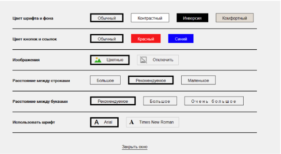

# Версионирование

## Статус
Предложенный

## Контекст
Необходимо предоставить возможность полноценного пользоваться сайтом людям с физическими ограничениями (нарушения работы органов зрения и опорно-двигательного аппарата), а также ситуативно повысить уровень комфорта в работе с сайтом и для здоровых людей.

### Юридический контекст

- ГОСТ 2014 года, который называется «Интернет-ресурсы, требования доступности для инвалидов по зрению». 

- приказ Минкомсвязи 2015 года: «Об установлении Порядка обеспечения условий доступности для инвалидов по зрению официальных сайтов федеральных органов государственной власти, органов государственной власти субъектов Российской Федерации и органов местного самоуправления в сети «Интернет». В приказе есть приписка, что отдельная версия должна присутствовать, только если основной сайт не соответствует требованиям доступности.

- новый ГОСТ 2020 года, заменивший ГОСТ 2014 года, «Интернет-ресурсы и другая информация, представленная в электронно-цифровой форме. Приложения для стационарных и мобильных устройств, иные пользовательские интерфейсы. Требования доступности для людей с инвалидностью и других лиц с ограничениями жизнедеятельности» (разработан на основе WCAG). В названии уже пропал фокус исключительно на людях с ограничениями по зрению и приводятся требования и рекомендации по обеспечению доступности для людей с ограниченными возможностями в целом. 

## Решение
Разрабатывать интерфейс и верстать в соответствие с рекомендациями по доступности содержимого веб-ресурсов WCAG (Web Content Accessibility Guidelines).

## Альтернативы
### 1. **Отдельная версия сайты для слабовидящих на отдельном URL.**
Отдельный шаблон или плагин. Включается при переходе по одноимённой ссылке или при клике на иконку глаза или очков 

### Плюсы:
- Как будто бы специальная версия призвана помочь слабовидящим получить нужную им информацию.
- Как будто бы она охватывает сразу несколько категорий людей с нарушениями зрения.
- Как будто бы её нужно внедрить по закону.

### Минусы:
- Не учитывает доступность для людей с заболеваниями опорно-двигательного аппарата.
- Отсутствие части контента по сравнению с обычной версией, в т.ч. части оформления, которое помогает навигироваться (нет оформления = нет информации).
- Нужно поддерживать две отдельных версии сайта.
- Единого стандарта на разработку версии сайта для слабовидящих не существует.
- Новый ГОСТ, основанный на WCAG, говорит, что отдельная версия должна присутствовать, только если основной сайт не соответствует требованиям доступности, которые можно сделать на основном сайте.

### 2. **Панель для слабовидящих / панель комфортного чтения.**

### Плюсы:
- Не нужно делать отдельную версию сайта. Решает вопросы с контрастностью и размером шрифта.
### Минусы:
- Ограниченный функционал.

**В основном слабовидящие включают скрин-зум, покупают большие мониторы, используют экранную лупу, тёмные темы или высококонтрастный режим и скринридеры или голосовые синтезаторы. 
Версия для слабовидящих не кажется полезной в этом контексте.**

[Доклад Повседневные барьеры в цифровой среде для слабовидящего](https://www.youtube.com/watch?v=m-Hl-YBRLUw&t=6s) 
[Доклад Лена Райан: Версия для слабовидящих? А можно не надо?](https://www.youtube.com/watch?v=F8RZTWeaDnY&t=289s)

 
*Пример панели для слабовидящих*

## Последствия
Не нужно будет тратить дополнительное время на версию для слабовидящих, если у вас уже доступный сайт (соответствующий WCAG уровня АА). 
Нужно будет скомбинировать автоматизированное и ручное тестирование фич доступности, т.к. далеко не все можно автоматизировать (см. далее). 

## Плюсы
Инклюзивность. Подход соответствует лучшим практикам современной разработки.

## Минусы
По WCAG, доступность определяется 4 принципами: воспринимаемость, управляемость, понятность и надежность. В зависимости от качества выполнения этих условий, сайты подразделяются на уровни доступности:
Минимальный (A)
Средний (АА) - требуемый по законам
Высокий (ААА) - если сайт специализированный для людей с ограниченными возможностями
Удобный ресурс, чтобы видеть требования WCAG в зависимости от уровня: [How to meet WCAG](https://www.w3.org/WAI/WCAG22/quickref/)

 

Совместить все требования стандартов с крутым дизайном, отлаженным функционалом и кроссбраузерностью нелегко. Соблюдение всей строгости правил может повлиять на фирменный стиль, на удобство интерфейса для среднестатистического пользователя, на способ подачи информации и многое другое.
Дизайнерское видение чаще всего идет вразрез с требованиями стандартов.
Стандарт следует воспринимать не как строгий гайдлайн, но как рекомендацию, которая значительно расширяет аудиторию ресурса.
