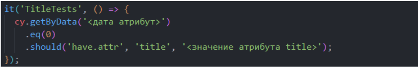

# Тестирование доступности

Тестировать нужно все, что касается взаимодействия пользователя с системой.

## Что именно тестировать?

- Атрибуты (role, tabindex, aria-атрибуты)
- Взаимодействие (клики, навигация с клавиатуры)
- Визуальная составляющая (тексты, контраст, расположение элементов и т.д.)

## Анализаторы доступности:

- [Eslint-plugin-jsx-a11y](https://www.npmjs.com/package/eslint-plugin-jsx-a11y) - линтер доступности JSX элементов
- [Stylelint-a11y](https://www.npmjs.com/package/stylelint-a11y) - линтер CSS
- [AccessLint](https://accesslint.com/) - апп для гитхаба, который находит проблемы с доступностью в пулреквестах в HTML
- [axe-core](https://www.npmjs.com/package/cypress-axe) - библиотека, интегрируемая в cypress 

*Пример работы axe в cypress*

*Подробная информация в консоли*

*[Улучшенные логи axe](https://github.com/denis-biruk/a11y-test-tabs/blob/master/cypress/support/commands/checkPageA11y.js)*

В cypress из коробки по прежнему нет поддержки браузерных событий (например tab click). Но есть плагин [Cypress-real-events](https://github.com/dmtrKovalenko/cypress-real-events) (MIT), который позволяет проверять браузерные события.
Ссылка на [stackoverflow](https://stackoverflow.com/questions/55009332/cypress-type-tab-key).

Playwright позволяет тестировать браузерные события, для него также есть плагин axe-core.

### Плюсы Playwright

- Тестирование нативных браузерных событий
- Есть плагин axe-core

### Минусы Playwright
- Интерфейс менее наглядный, чем в Cypress
- Для нас выше порог входа
- Синтаксис более многословный (async, переходы по url)

 
*Пример проверки alt на Cypress* 

 
*Примеры проверки alt на Playwright* 

 
*Пример проверки alt на Cypress* 

 
*Примеры проверки alt на Playwright* 

 
*Пример проверки title на Cypress* 

 
*Примеры проверки title на Playwright* 

 
*Пример проверки label на Cypress* 

 
*Примеры проверки label на Playwright* 

 
*Пример проверки placeholder на Cypress* 

 
*Примеры проверки placeholder на Playwright* 

 
*Пример проверки aria на Cypress* 

 
*Примеры проверки aria на Playwright* 

Выборка производится по aria ролям, определённых в спецификации W3C (пункт 5.2.8.4) - https://www.w3.org/TR/wai-aria-1.2/#roles

 
*Пример проверки tab на Cypress* 

 
*Примеры проверки tab на Playwright* 

  
*Пример обращения к элементам различными способами на Playwright* 

Страница [Locators API](https://playwright.dev/docs/locators) в документации Playwright.

  
*Пример проверки контрастности на Cypress с использованием пакета axe-core*  

  
*Пример проверки контрастности на Playwright с использованием пакета axe-core*  

## Что нельзя протестировать автоматически?
- Цветовое восприятие 

- Избыточность лейблов 

- Визуальный порядок контента (tab order должен соответствовать реальному)
- Наложение интерфейса (например при зуме) 
 
- Неправильная семантика (например email на таблицах) 
  
*Убираем семантику*

- Удобство использования
- Ловушки для фокуса (датапикеры, модалки) 

- Контент: тексты, валидация форм, переводы 

- Адекватность альтов 

[Доклад: Как протестировать accessibility руками](https://www.youtube.com/watch?v=-N34pdUcJf0&list=PLNSmyatBJig6ciyZ8A8zU0ZCngZxj858X&index=14)
[Доклад: npm run a11y-test](https://holyjs.ru/archive/2021%20Piter/talks/6zmpjnochngcpe7qksvglj/?referer=/archive/2021%20Piter/talks/)

### Инструменты 
- Автоматический отчет о доступности
- [W3C Валидатор](https://validator.w3.org/)
- Google Lighthouse
- [WAVE](https://wave.webaim.org/) Web Accessibility Evaluation Tool 
- [axeDevTools](https://chromewebstore.google.com/detail/axe-devtools-web-accessib/lhdoppojpmngadmnindnejefpokejbdd?utm_source=deque.com&utm_medium=referral&utm_campaign=axe_chrome_logo)

- Скринридеры (NVDA для Windows, VoiceOver для Mac)
