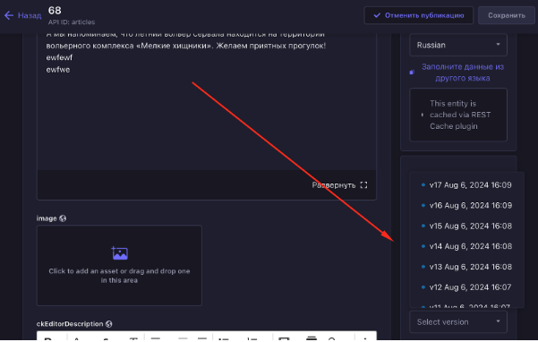

# Версионирование

## Статус
Предложенный

## Контекст
Необходимо иметь доступ к черновой и опубликованной версии контента, при этом черновик и опубликованная версия должны существовать вместе.

## Решение
Плагин [Content Versioning](https://market.strapi.io/plugins/@notum-cz-strapi-plugin-content-versioning) (MIT) добавляет возможность смотреть разные версии. контента.

### Управление версиями

## Альтернативы
Ждать Strapi v5

### Плюсы:
Необходимый функционал идет из под коробки.

### Минусы:
Время ожидания неопределенное.

## Последствия
Данное решение позволит добавить возможность создания разных версий контента.

## Плюсы
Соответствует всем нашим требованиям.

## Минусы
Нет
