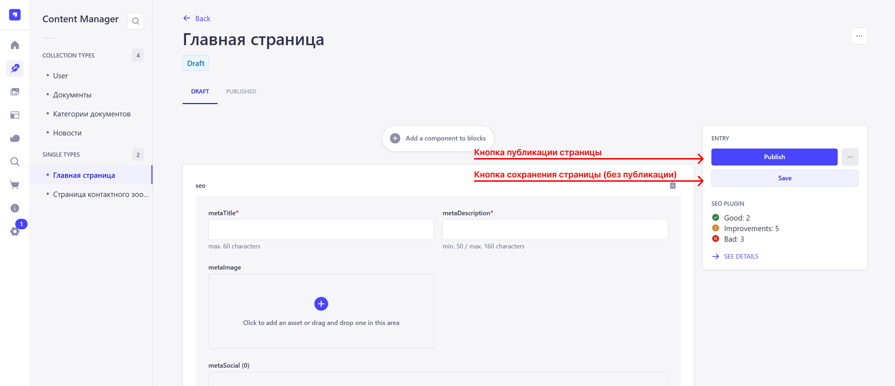
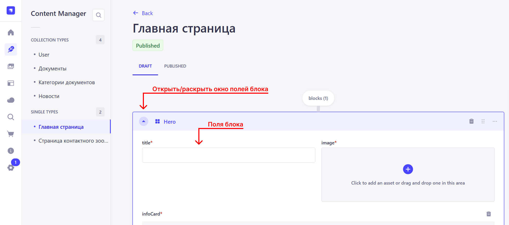
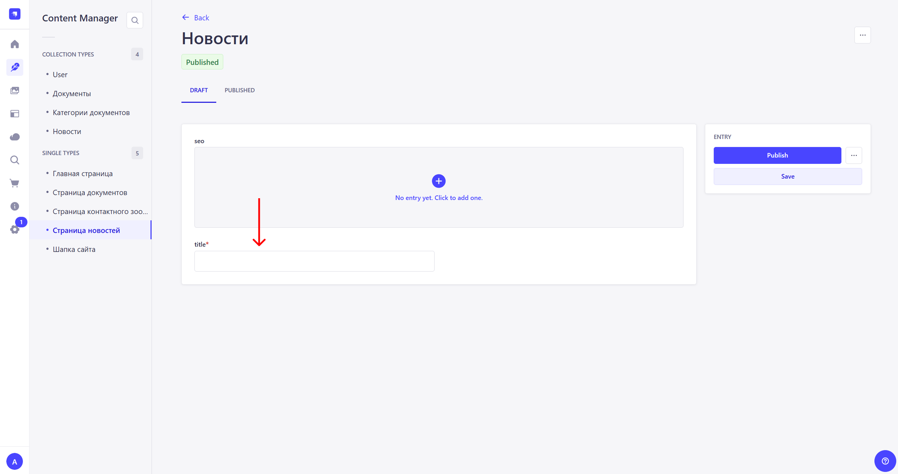

# Инструкция по началу работу с CMS Strapi.md

При первом запуске проекта вместо главной страницы и страницы контактного зоопарка (/contact-zoo) 
будут отображаться страницы 404. Происходит это, потому что на стороне CMS эти страницы еще не были 
созданы и опубликованы.  

  

Чтобы сделать страницы доступными, необходимо (в случае local-env):  
1. Открыть админ-панель Strapi, перейдя по ссылке:  
      http://localhost:40110/cms/admin  

      Откроется окно авторизации. Необходимо авторизоваться, используя логин и пароль:  
      *Логин: admin@init-strapi-admin.strapi.io*  
      *Пароль: admin*  

      Примечание: Креды могут измениться, актуальные смотреть в readme.md в репозитории pelican-local-env:  
      https://github.com/TourmalineCore/pelican-local-env

        

2. После авторизации необходимо перейти в раздел “Content manager”, который расположен в левой части экрана.  

        

3. Создание и публикация главной страницы.  
      3.1 В левой части экрана необходимо выбрать раздел “Главная страница”.  

        

      3.2 Должно открыться окно редактирования страницы. Далее необходимо нажать на “+” в блоке seo.  

        

      3.3 Появиться несколько полей. Обязательные поля помечены красной звездочкой в правом верхнем углу поля.  

        

      3.4 Заполнив требуемые поля, необходимо нажать на кнопку “Save” в правой части экрана, для сохранения черновика. После нажать на кнопку “Publish” для ее публикации.  

        

      3.5 Переходим на UI по ссылке: http://localhost:40110/ и видим, что страница стала доступна.  

        

      3.6 Добавление других блоков аналогично. Необходимо нажать на “+” в верхней части экрана (над блоком seo).  

        

      3.7 Далее откроется список доступных блоков, из которых некоторые вынесены в отдельную категорию, например, “Home”. Необходимо выбрать нужный блок, например, “Hero”. 

      Блоки “Shared” доступны глобально для всех страниц, блоки “Home” только для главной страницы.  

        

      3.8 Аналогично блоку seo, необходимо заполнить требуемые поля блока.  

        

      3.9 Далее нужно сохранить и опубликовать изменения на странице. Аналогично seo.  

        

4. Создание и публикация страницы контактного зоопарка.  
      4.1 В левой части экрана необходимо выбрать “Страница контактного зоопарка”.  

        

      4.2 Далее аналогично главной странице. 

5. Создание и публикация контента шапки сайта.   
      5.1 В левой части экрана необходимо выбрать "Шапка сайта".  

        

      5.2 Откроется окно редактирования контента шапки сайта.  

        

      5.3 Заполнив требуемые поля, необходимо нажать на кнопку “Save” в правой части экрана, для сохранения черновика. После нажать на кнопку “Publish” для ее публикации.  

        

На этом этапе будет отображаться шапка и футер сайта, а также пустая главная страница и страница контактного зоопарка.

## Опционально, не обязательно для первого запуска

6. Добавление новостей.  
      6.1 Для того, чтобы страница новостей стала доступна, сначала нужно определить ей параметры SEO. В левой части экрана необходимо выбрать раздел "Страница новостей".  

        

      6.2 Откроется окно редактирования страницы новостей.  

        

      6.3 Необходимо нажать на "+ No entry yet. Click to add one." и заполнить требуемые поля SEO, а также поле title.

        

      6.4 Для добавления новостей необходимо выбрать раздел “Новости” в левой части экрана. После нажать на “+ Create new entry”.  

        

      6.5 Далее логика аналогична добавлению новой страницы.  

7. Добавление категорий документов.  
      7.1 Аналогично новостям. Поле hasTabs позволяет добавлять/убирать разделение по годам в категории документов.  

8. Добавление документов.  
      8.1 Аналогично новостям, исключение лишь то, что перед созданием документа должна быть создана хотя бы 1 категория.

