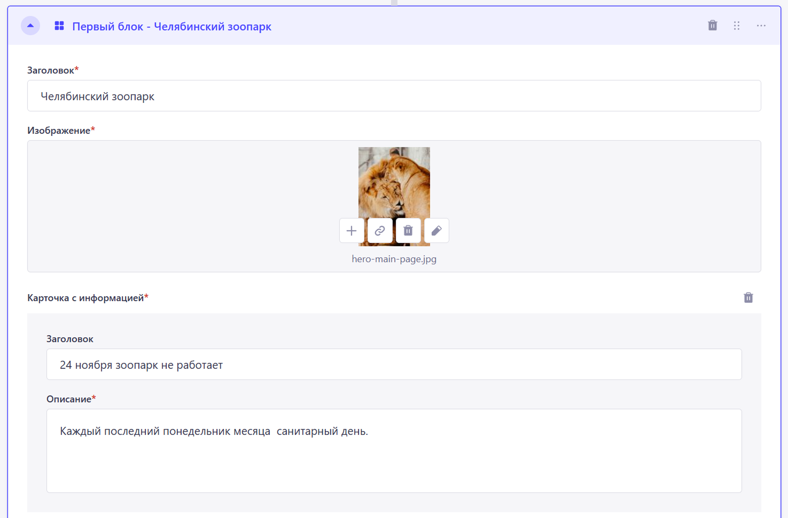
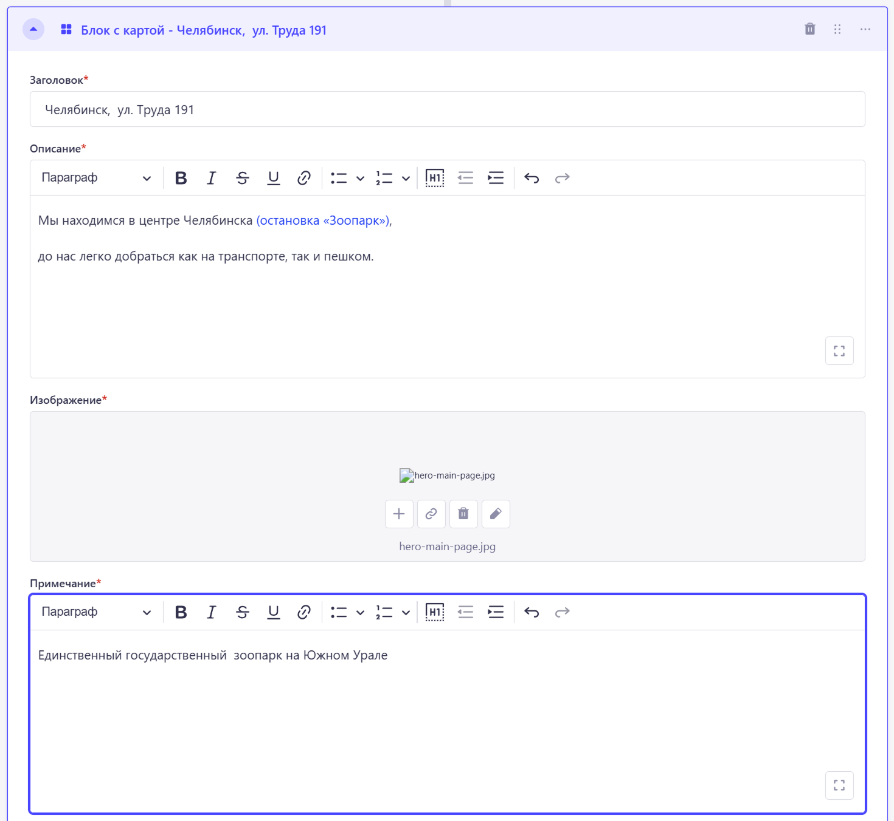

# Инструкция по работе с CMS Strapi  

## Содержание:
1. [Ссылки](#links)  
  1.1 [Local-env](#links-local-env)  
  1.2 [Локальная разработка](#links-local)  
2. [Авторизация в CMS](#auth-in-cms)  
  2.1 [Смена языка интерфейса CMS](#auth-in-cms--change-language)  
3. [Общая информация](#common-information)  
  3.1 [Выход из аккаунта в CMS](#logout)  
  3.2 [Черновик и опубликованная версия](#draft-and-published)  
  3.3 [Предварительный просмотр](#preview)  
  3.4 [Обязательные поля](#required-fields)  
  3.5 [Загрузка файлов.](#upload-images)  
4. [Редактирование страниц](#edit-pages)  
  4.1 [Добавление блоков](#add-blocks)  
  4.2 [Виды блоков](#kind-blocks)  
  4.3 Шапка сайта  
  4.4 Главная страница  
  4.5 Страница контактного зоопарка  
  4.6 Страница новостей  
  4.7 Страница документов  
5. Добавление новостей  
6. Добавление документов  
7. Минимальная настройка перед началом работы
8. [Local-env](#local-env-chapter)  
  8.1 [Создание бэкапов postgres и s3](#postgres-and-s3-backups)  
  8.2 [Откат к версии бэкапов postgres и s3](#postgres-and-s3-rollback-to-backups)  
9. [Возможные ошибки](#errors)  
  9.1 [На frontend`е отображается 404 страница, вместе искомого контента](#errors-404-page)  

<h2 id="links">1. Ссылки:</h2>  
<h3 id="links-local-env">1.1 Local-env:</h3>  

  - Frontend: http://localhost:40110  
  - CMS: http://localhost:40110/cms/admin  
  - MinIO-S3: http://minio-s3-console.localhost:40110  

<h3 id="links-local">1.2 Локальная разработка:</h3>  

> Примечание: порты могут изменяться

  - Frontend: http://localhost:3000  
  - CMS: http://localhost:1337  
  - MinIO-S3: http://localhost:9001  

<h2 id="auth-in-cms">2. Авторизация в CMS:</h2>  
Перед тем, как начать взаимодействие с контентом сайта, необходимо пройти авторизацию в системе управления контентом (далее CMS). Для этого необходимо перейти на страницу CMS, открыв ссылку URL в любом доступном браузере.<br><br>

Перейдя по ссылке на страницу CMS, откроется окно авторизации, которое выглядит следующим образом:  

 
*Окно авторизации CMS*  

Для прохождения авторизации необходимо:  
1. Указать Email в поле 1  
2. Указать пароль в поле 2  
3. Нажать на кнопку 4   

Опционально можно установить галочку в поле 3. В этом случае при следующем посещении страницы CMS прохождение авторизации не потребуется.  

<h3 id="auth-in-cms--change-language">2.1 Смена языка интерфейса CMS</h3>  
Поле 5 позволяет выбрать язык, на котором будет отображаться интерфейс CMS (Русский/English).  

<h2 id="common-information">3. Общая информация</h2>  
<h3 id="logout">3.1 Выход из аккаунта в CMS</h3>  

  
*Порядок выхода из аккаунта в CMS*  

Для того, чтобы выйти из аккаунта, в который ранее была произведена авторизация, необходимо:  
1. Нажать на иконку 1  
2. Нажать на опцию 2  

После этого текущая авторизованная сессия будет прервана и потребуется повторная авторизация.  

<h3 id="draft-and-published">3.2 Черновик и опубликованная версия контента:</h3>  
Весь контент в CMS имеет черновую версию (Черновик/Draft) и опубликованную версию (Published). Черновик доступен только через CMS, тогда как опубликованная отображается на сайте.<br><br>

  
*Переключение между версиями контента*  

Например, заполним компонент “Первый блок” на главной странице и опубликуем её. В разделе “Published” контент будет отображаться следующим образом:<br><br>

  
*Опубликованная версия главной страницы*  

Далее переключимся на “Draft” версию контента и внесем изменения в поле “Заголовок” в карточке с информацией:<br><br>

  
*Черновая версия главной страницы*  

В случае, если черновик отличается от опубликованной версии, то поле 1 заменяется с “Draft” на “Modified”.  

Открыв сайт, увидим, что в карточке с информацией указано “29 октября”, а не “24 ноября”, то есть то, что указано в опубликованной версии, а не в черновике.<br><br>

  
*Главная страница на frontend`е*  

<h3 id="preview">3.3 Предварительный просмотр:</h3>  
При редактировании черновой версии страницы есть возможность посмотреть на то, как будет выглядеть контент на сайте. На странице черновика в правой части экрана располагается кнопка "Открыть превью черновика", нажав на которую откроется frontend с контентом, который задан в черновой версии страницы.<br><br>

  
*Кнопка предварительного просмотра страницы*  

Возвращаясь к предыдущему примеру (пункт 3.2), если открыть предварительный просмотр черновига главной страницы, то мы увидим, что отображается версия контента, которая задана в черновике и которая отличается от ранее опубликованной.<br><br>

  
*Отображение черновой версии главной страницы*  

<h3 id="required-fields">3.4 Обязательные поля:</h3>  
В большинстве типов контента встречаются поля, без заполнения которых не получится опубликовать тот или иной контент. Такие поля являются обязательными для заполнения и помечаются символом красной звездочки справа от наименования поля.<br><br>

  
*Обязательные и необязательные поля*  

<h3 id="upload-images">3.5 Загрузка файлов:</h3>  
Некоторые блоки имеют поля загрузки медиа контента (видео/изображения и другие файлы). Выглядят они следующим образом:<br><br>

  
*Поле загрузки файлов*  

  
*Окно выбора файла*  

  
*Окно загрузки файла*  

  
*Окно подтверждения загрузки файлов*  

Для загрузки контента в поле необходимо:
1. Нажать на кнопку 1
2. Нажать на кнопку 2 (Если файл ранее был загружен, то необходимо выбрать нужный и нажать кнопку “Готово”, остальные пункты пропустить)
3. Нажать кнопку 3
4. Выбрать требуемый файл (В случае, если нужно загрузить несколько файлов, нажать на кнопку 5 и выбрать дополнительные файлы)
5. Нажать на кнопку 4

<h2 id="edit-pages">4. Редактирование страниц</h2>  
<h3 id="add-blocks">4.1 Добавление блоков:</h3>  
На большинстве страниц доступна возможность добавления новых блоков на страницу. Некоторые страницы имеют возможность добавления блоков различных групп (например, группы shared и home в случае главной страницы).<br><br>

Кнопка добавления нового блока выглядит следующим образом:  

  
*Кнопка добавления нового блока*  

Если нажать на кнопку, то откроентся окно выбора блока:  

  
*Окно выбора блока*  

Под цифрой 1 обозначены группы блоков (shared и home).  
Под цифрой 2 обозначены доступные блоки.  
Под цифрой 3 обозначена кнопка выхода из окна выбора блока.  

При нажатии на требуемый блок, окно выбора будет закрыто, а на его месте появится выбранный блок, нажав на который, отобразятся доступные поля для заполнения.<br><br>

  
*Добавленный блок*  

  
*Добавленный блок*  

<h3 id="kind-blocks">4.3 Виды блоков:</h3>  
<h4 id="blocks-shared-group">Группа shared (общие блоки):</h4>  
а. Первый блок:<br><br>

  
*Внешний вид первого блока*  

  
*Поля первого блока (часть 1)*  

  
*Поля первого блока (часть 2)*  

б. Блок с картинкой/видео:<br>

  
*Внешний вид блока с картинкой/видео*  

  
*Поля блока с картинкой/видео*  

в. Блок с картинкой и кнопкой:<br>

  
*Внешний вид блока с картинкой и кнопкой*  

  
*Поля блока с картинкой и кнопкой*  

г. Блок с билетами:<br>

  
*Внешний вид блока с билетами*  

  
*Поля блока с билетами*  

<h4 id="blocks-home-group">Группа home:</h4>  
а. Блок с услугами:<br><br>

  
*Внешний вид блока с услугами*  

  
*Поля блока с услугами*  

б. Блок с картой:<br>

  
*Внешний вид блока с картой*  

  
*Поля блока с картой*  

в. Блок с билетами:<br>

  
*Внешний вид блока с билетами*  

  
*Поля блока с билетами (часть 1)*  

  
*Поля блока с билетами (часть 2)*  

<h2 id="local-env-chapter">8. Local-env</h2>  
<h3 id="postgres-and-s3-backups">8.1 Создание бэкапов postgres и s3:</h3>  

> Примечание: предварительно необходимо запустить local-env, смотри:  
> https://github.com/TourmalineCore/pelican-local-env  

Для создания бэкапа текущей версии postgres и s3 в local-env необходимо:
1. Перейти в ветку s3-backup в репозитории pelican-local-env:  

2. Подгрузить бэкаппер s3, выполнив команду:  
```
helmfile cache cleanup && helmfile --environment local --namespace local -f deploy/helmfile.yaml apply
```  

3. Перейти в ветку pgsql-backup в репозитории pelican-local-env:  

4. Подгрузить бэкаппер pgsql, выполнив команду:  
```
helmfile cache cleanup && helmfile --environment local --namespace local -f deploy/helmfile.yaml apply
```  

5. Перейти в интерфейс MinIO и скачать полученные бэкапы.  

> Примечание: порядок авторизации в MinIO смотри:  
> https://github.com/TourmalineCore/pelican-local-env  

<h3 id="postgres-and-s3-rollback-to-backups">8.2 Откат к версии бэкапов postgres и s3:</h3>    
<h4>Для отката версии postgres к версии бэкапа необходимо:</h3>  

1. Сделать под postgresql-0 доступным, для этого необходимо:  
1.1 Открыть кластер в Lens и перейти в раздел Workloads -> Pods.  

  
*Раздел Pods в Workloads*  

1.2 Найти под postgresql-0 и нажать на него.  

  
*Под postgresql-0*  

1.3 В открывшемся окне найти кнопку "Forward", после нажать кнопку "Start".  

  
*Forward postgresql-0 pod*  

  
*Start forward postgresql-0 pod*  

Откроется окно в браузере, где необходимо скопировать порт.  

  
*Postgresql-0 pod port*  

2. Перемещаем бекап postgres в рабочую директорию, открываем в ней терминал.  

  
*Перемещение бэкапа в рабочую директорию*  

3. Выполняем команду очистки схемы базы, чтобы исключить возможность возникновения конфликтов при откате к бэкапу. (Нужно подставить порт из пункта 1.3)  
```
psql -U postgres -h localhost -p <порт> -d pelican_db -c "DROP SCHEMA public CASCADE CREATE SCHEMA public"
```
> Примечание: потребуется ввести пароль от пользователя postgres в базе данных:  
> `password`: *admin*   

4. Выполняем команду копирования базы данных из бэкапа. (Нужно подставить порт из пункта 1.3 и наименование бэкапа)  
```
psql -U postgres -h localhost -p <порт> -d pelican_db -f ./<наименование бэкапа>
```  

> Примечание: потребуется ввести пароль от пользователя postgres в базе данных:  
> `password`: *admin*  

  
*Перемещение бэкапа в рабочую директорию*  
  
<h4>Для отката версии s3 к версии бэкапа необходимо:</h3>  

1. Разархивировать архив бекапа s3 в папку.
2. Открыть интерфейс MinIO, перейдя по ссылке: http://minio-s3-console.localhost:40110 

> Примечание: в случае локальной разработки ссылка будет другой, смотри пункт 1.2  

3. Авторизоваться, введя логин и пароль:  
- `login`: *admin*  
- `password`: *rootPassword*  
4. Очистить хранилище, выбрав все файлы и нажав на кнопку Delete (если там что-то есть).  
5. Нажать кнопку Upload и выбрать все файлы из бэкапа s3.  

  
*Загрузка файлов в MinIO*  

<h2 id="errors">Возможные ошибки</h2>    
<h3 id="errors-404-page">9.1 На frontend`е отображается 404 страница, вместе искомого контента:</h3>  

<!-- При первом запуске проекта вместо главной страницы и страницы контактного зоопарка (/contact-zoo) 
будут отображаться страницы 404. Происходит это, потому что на стороне CMS эти страницы еще не были 
созданы и опубликованы.  

  

Чтобы сделать страницы доступными, необходимо (в случае local-env):  
1. Открыть админ-панель Strapi, перейдя по ссылке:  
      http://localhost:40110/cms/admin  

      Откроется окно авторизации. Необходимо авторизоваться, используя логин и пароль:  
      *Логин: admin@init-strapi-admin.strapi.io*  
      *Пароль: admin*  

      > Примечание: Креды могут измениться, актуальные смотреть в readme.md в репозитории pelican-local-env:  
      > https://github.com/TourmalineCore/pelican-local-env

        

2. После авторизации необходимо перейти в раздел “Content manager”, который расположен в левой части экрана.  

        

3. Создание и публикация главной страницы.  
      3.1 В левой части экрана необходимо выбрать раздел “Главная страница”.  

        

      3.2 Должно открыться окно редактирования страницы. Далее необходимо нажать на “+” в блоке seo.  

        

      3.3 Появиться несколько полей. Обязательные поля помечены красной звездочкой в правом верхнем углу поля.  

        

      3.4 Заполнив требуемые поля, необходимо нажать на кнопку “Save” в правой части экрана, для сохранения черновика. После нажать на кнопку “Publish” для ее публикации.  

        

      3.5 Переходим на UI по ссылке: http://localhost:40110/ и видим, что страница стала доступна.  

        

      3.6 Добавление других блоков аналогично. Необходимо нажать на “+” в верхней части экрана (над блоком seo).  

        

      3.7 Далее откроется список доступных блоков, из которых некоторые вынесены в отдельную категорию, например, “Home”. Необходимо выбрать нужный блок, например, “Hero”. 

      Блоки “Shared” доступны глобально для всех страниц, блоки “Home” только для главной страницы.  

        

      3.8 Аналогично блоку seo, необходимо заполнить требуемые поля блока.  

        

      3.9 Далее нужно сохранить и опубликовать изменения на странице. Аналогично seo.  

        

4. Создание и публикация страницы контактного зоопарка.  
      4.1 В левой части экрана необходимо выбрать “Страница контактного зоопарка”.  

        

      4.2 Далее аналогично главной странице.   -->
