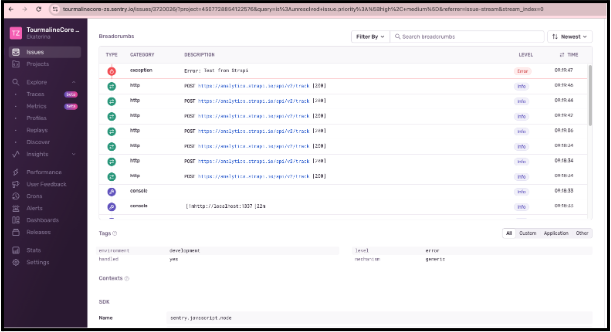

# Логирование

## Статус
Предложенный

## Контекст
Необходимо отслеживать ошибки в strapi.

## Решение

Плагин [Sentry](https://market.strapi.io/plugins/@strapi-plugin-sentry) (MIT) добавляет возможность отслеживания ошибок.

### Управление версиями

## Альтернативы
Не рассматривали.

## Последствия
Данное решение позволит удобно отслеживать возникающие ошибки в strapi.

## Плюсы
Соответствует всем нашим требованиям.

## Минусы
Нет.
