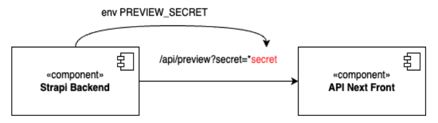

# Предпросмотр сайта

## Статус
Предложенный

## Контекст
Необходим функционал для предпросмотра сайта перед публикацией, а также хотелось бы, чтобы была возможность передавать секрет в url и смотреть вариант черновика.

## Решение
Плагин [Preview button](https://market.strapi.io/plugins/strapi-plugin-preview-button) (MIT) добавляет в админскую панель кнопку для предпросмотра сайта. Также с помощью него можно настроить просмотр чернового варианта через передачу секрета в url.
### Кнопка превью в админке

## Альтернативы
Нет

## Последствия
Данное решение позволит нам реализовать функционал предпросмотра сайта до публикации.

## Плюсы
Соответствует всем нашим требованиям.

## Минусы
Сложность настройки просмотра черновиков через секрет в url.

### Ссылка на PR с инвестигейтом
https://github.com/TourmalineCore/strapi-poc/tree/feature/preview-button-plugin

## Схема передачи секрета

 
Секреты нельзя передавать в query, т.к. они не шифруются в отличие от хедеров. Пока что получилось передать секреты только в query параметрах, при открытии черновика секрет виден в url.

Доступ к секрету могут получить люди которым доступна админка Strapi. Есть вероятность, что кто-то может увидеть секрет в экране человека (посмотрев в монитор, через скрин или демонстрацию экрана). Однако при получении доступа к секрету человек будет иметь доступ только к неопубликованной информации на сайте. Кажется, что особо ни какой секьюрной информации на сайте не будет.

[Дока next про preview mode](https://nextjs.org/docs/pages/building-your-application/configuring/preview-mode)
[Пример настройки preview mode strapi и next](https://strapi.io/blog/implementing-previews-with-next-applications-using-a-strapi-backend)
