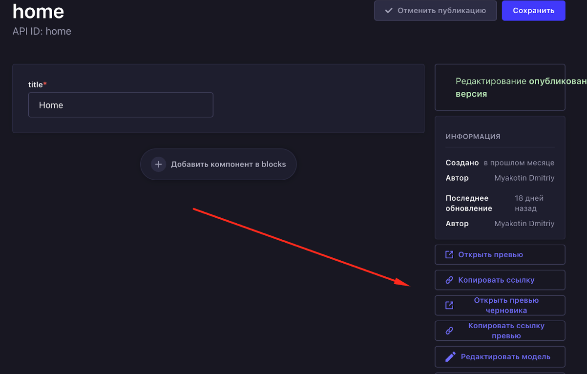

# Предпросмотр сайта

## Статус
Предложенный

## Контекст
Необходим функционал для предпросмотра сайта перед публикацией, а также хотелось бы, чтобы была возможность передавать секрет в url и смотреть вариант черновика.

## Решение
Плагин [Preview button](https://market.strapi.io/plugins/strapi-plugin-preview-button) (MIT) добавляет в админскую панель кнопку для предпросмотра сайта. Также с помощью него можно настроить просмотр чернового варианта через передачу секрета в url.
### Кнопка превью в админке

## Альтернативы
Нет

## Последствия
Данное решение позволит нам реализовать функционал предпросмотра сайта до публикации.

## Плюсы
Соответствует всем нашим требованиям.

## Минусы
Сложность настройки просмотра черновиков через секрет в url.

### Ссылка на PR с инвестигейтом
https://github.com/TourmalineCore/strapi-poc/tree/feature/preview-button-plugin