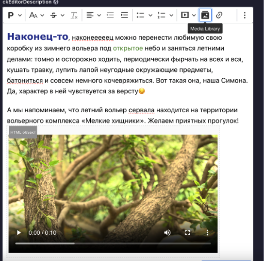

# Редактор новостей

## Статус
Предложенный

## Контекст
Необходим редактор с помощью которого можно было бы добавлять картинки, видео, текст. Хотелось бы, чтобы редактор был достаточно гибким.

## Решение
Плагин [CKEditor 5](https://market.strapi.io/plugins/@_sh-strapi-plugin-ckeditor) (GNU GPL 2) расширяет стандартный Rich text, представленный strapi.

### Вид редактора

## Альтернативы
Использовать стандартный редактор в strapi

### Плюсы:
- Идет по умолчанию
- Лицензия

### Минусы:
- Позволяет вставлять видео только ссылкой
- Меньше вариантов кастомизации текста по сравнению с CKEditor 5

## Последствия
Данное решение позволит нам удовлетворить требования клиента по редактированию новостей.

## Плюсы
Соответствует всем нашим требованиям.

## Минусы
Нет
