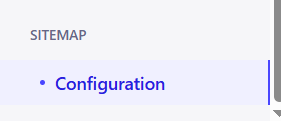
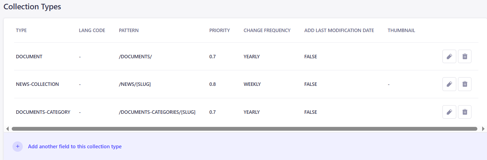
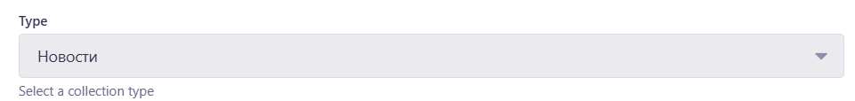
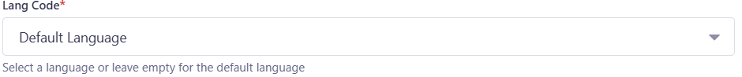
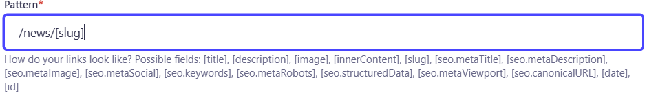
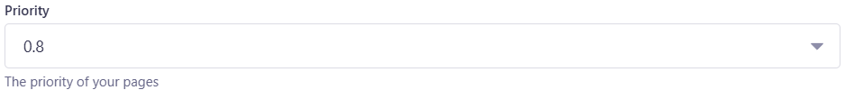
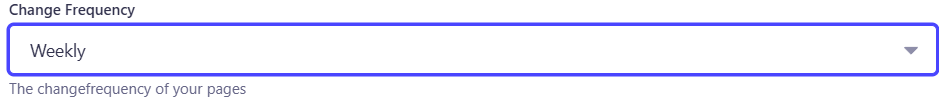
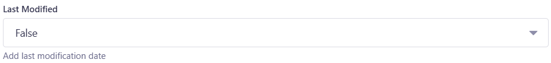
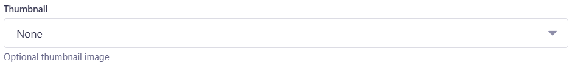
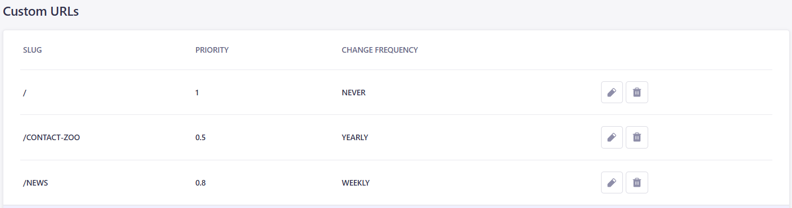

# Robot.txt и Sitemap

## Введение: Зачем нужны файлы robots.txt и sitemap.xml

Файлы robots.txt и sitemap.xml играют важную роль в оптимизации сайта для поисковых систем. Эти файлы помогают поисковым роботам правильно индексировать ваш сайт, что улучшает видимость в результатах поиска.

### Robots.txt
Файл robots.txt используется для управления доступом поисковых роботов к сайту. Он позволяет указывать, какие страницы или разделы сайта должны быть проиндексированы, а какие — нет. Это **особенно** полезно, если вы хотите скрыть от индексации определенные страницы, например, страницы с конфиденциальной информацией или дублирующимся контентом.

Пример нашего robots.txt:

```
User-agent: *// * Означает, что мы скрываем страницу для всех роботов (Googlebot, Yandex и т.д)
Disallow: /components // Скрываем страницу компонентов

Host: chelzoo.ru // Домен нашего сайта

Sitemap: https://chelzoo.ru/api/get-sitemap / Эндпоинт, который возвращает xml файл
```

### Sitemap.xml
Файл sitemap.xml представляет собой карту сайта, которая помогает поисковым системам лучше понять структуру вашего сайта и быстрее находить новые или обновленные страницы. В отличие от robots.txt, который ограничивает доступ, sitemap.xml направлен на улучшение индексации. Этот файл содержит список всех URL-адресов сайта, а также дополнительную информацию о каждом URL, такую как дата последнего обновления, частота обновления и приоритет.

#### Настройка Sitemap.xml
Настройка sitemap осуществляется в репозитории [pelican-cms](https://github.com/TourmalineCore/pelican-cms), т.к наши страницы зависят от добавленного контента в Strapi. Для генерации sitemap используется плагин [strapi-5-sitemap-plugin](https://market.strapi.io/plugins/strapi-5-sitemap-plugin).

!Важно для того, чтобы получить sitemap на сайте, в репозитории [pelican-ui](https://github.com/TourmalineCore/pelican-ui), необходимо добавить в .env ENABLE_SITEMAP=true.

Переходим в настройки во вкладку sitemap configuration.


Здесь можно установить домен сайта.


Конфигурацию для коллекций.


Конфигурация состоит из следующих полей:

1. Type - в этом выбираем коллекцию для которой будет осуществлять настройку.


2. Lang Code - в этом поле выбираем подходящий язык.


3. Pattern - в этом поле настраивается ссылка, которая будет отображена в sitemap.


4. Priority - в этом поле настраивается приоритетность страницы (от 0.0 до 1.0). Не все поисковые роботы обращают внимание на это поле.


Рекомендации по расстановке приоритетов:
- Главная страница (/) – 1.0

Обычно самая важная, так как это входная точка для пользователей.

- Ключевые разделы и категории – 0.8 – 0.9

Основные категории, услуги, главные landing pages.

- Статьи, товары, подкатегории – 0.6 – 0.7

Важные, но не критичные, как главная страница.

- Второстепенные страницы (блог, FAQ, контакты) – 0.4 – 0.5

Полезные, но не ключевые для SEO.

- Технические и служебные страницы – 0.1 – 0.3

Политика конфиденциальности, условия использования и т. д.

5. Change Frequency - это поле, в котором нужно выбрать, как часто контент будет менять на этой странице. Роботы Google, Яндекс и других систем используют эту информацию, чтобы понять, как часто стоит перепроверять страницу на обновления.


6. Last Modified - добавляет в sitemap дату последнего обновления страницы, что помогает SEO понять какие страницы нужно переиндексировать. Рекомендуется выставлять true.


7. Thumbnail - это поле, в котором можно указать картинку, которая используется для указания превью изображений, связанных с страницами сайта. Оно особенно полезно для визуального контента, например, интернет-магазинов, галерей, блогов с картинками.


Помимо коллекций можно добавить свои URL, например главную страницу или страницу контактного зоопарка.



