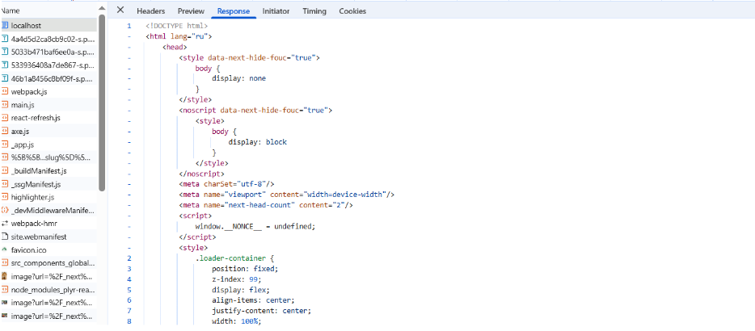
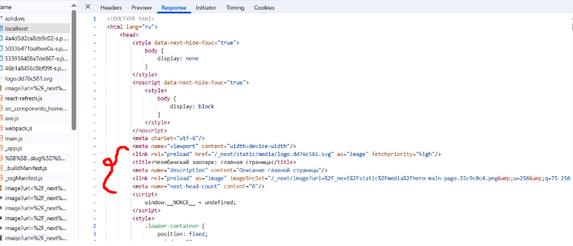

# Причина по которой meta теги и разметка страницы не приходила в серверном ответе.

## Проблема
Проблема была в том, что мы использовали подход с условным рендерингом компонентов и для этого использовали значение ширины экрана, которое можно получить с помощью window.innerWidth. Но проблема в том, что ширину экрана можно получить только на стороне клиента, а на сервере она равна 0.

Из-за того, что в Layout была вот такая проверка, на сервере не было разметки и meta-тегов, т.к. приходил null:

if (windowWidth === 0) {
    return null;
 }

Эту проверку мы добавили потому, что при загрузке сайта элементы дёргались: например, шапка сайта сначала показывалась в мобильном виде, а потом в десктопном. Это опять же связано с тем, что ширина экрана была 0, и при загрузке показывались мобильные элементы. Чтобы убрать дёрганье, добавили проверку выше в Layout, но это была ошибка.

## Решение
Для решения этой проблемы условный рендеринг был заменён на скрытие и показ компонентов с помощью display: none и media-запросов в CSS. Проверка на windowWidth === 0 была удалена из Layout.

До, meta тегов и разметки страницы в response страницы нету.

После, мета теги и разметка страницы есть в response страницы.

Такое изменение повлекло за собой также прирост производительности сайта — показания Lighthouse улучшились:

Desktop 90-92 -> 96-97 
Mobile 45-48 -> 76-78

[PR с фиксом](https://github.com/TourmalineCore/pelican-ui/pull/443)