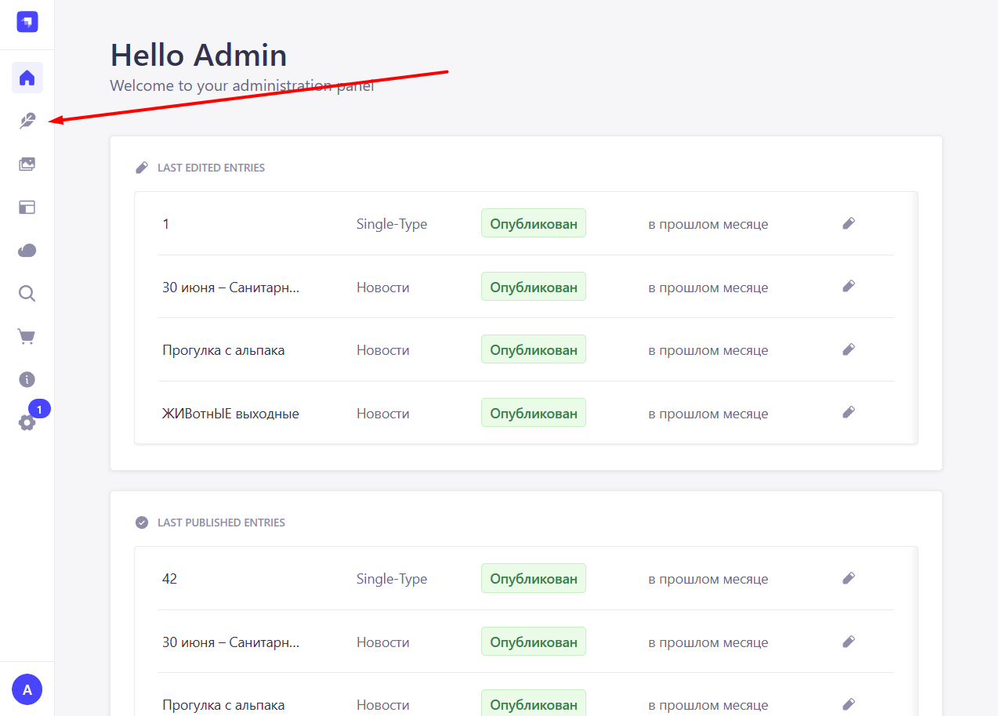
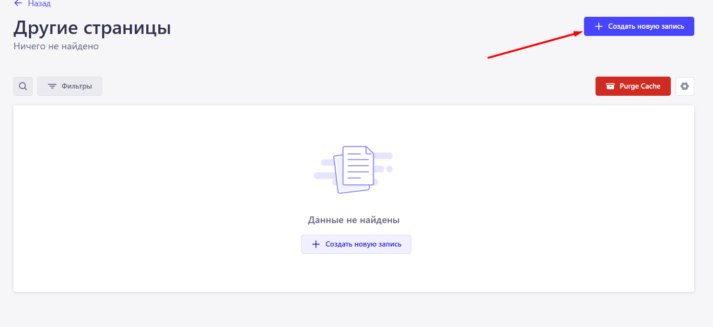
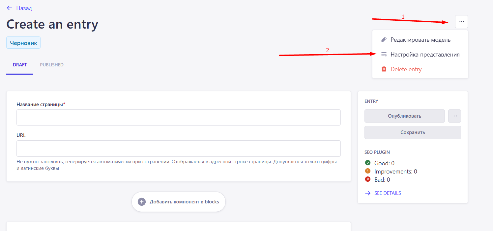
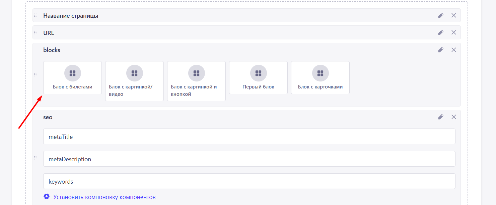
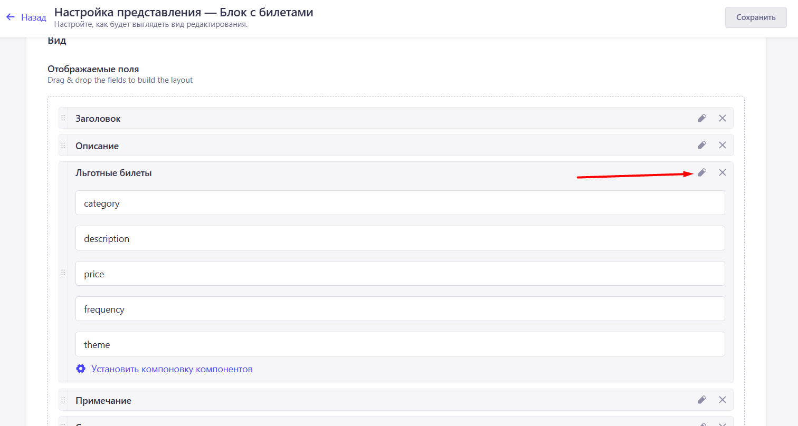
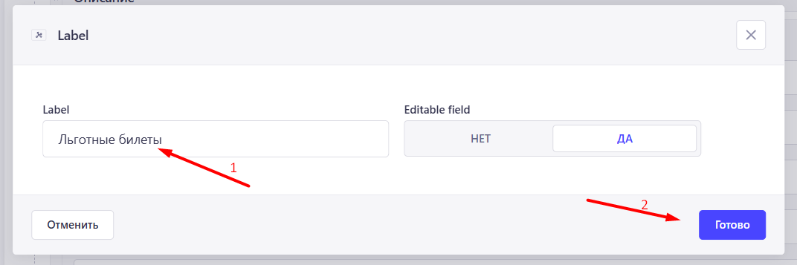
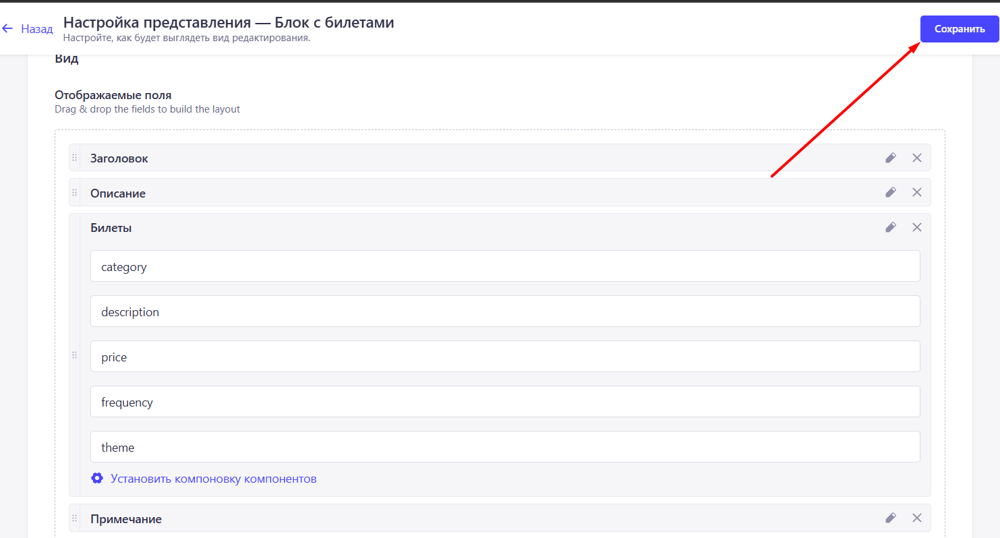

# Как переименовывать поля в Strapi

Переименование поля на примере компонента "Блок с билетами"

1. Перейдите во вкладку редактирования контента

2. Перейдите во вкладку где используется компонент который вы хотите переименовать, "Блок с билетами" используется в коллекции "Другие страницы" поэтому переходим туда

3. Нажмите создать новую запись 

4. Нажмите на троеточие и выберите "Настройка представления"

5. Выберите нужный блок, в нашем случае это "Блок с билетами"

6. Выберите поле которые хотите переименовать, в нашем случае это "Льготные билеты"

7. Меняете название блока на нужное, в нашем случаем на "Билеты"

8. Сохраните изменения

Поле успешно переименовано.