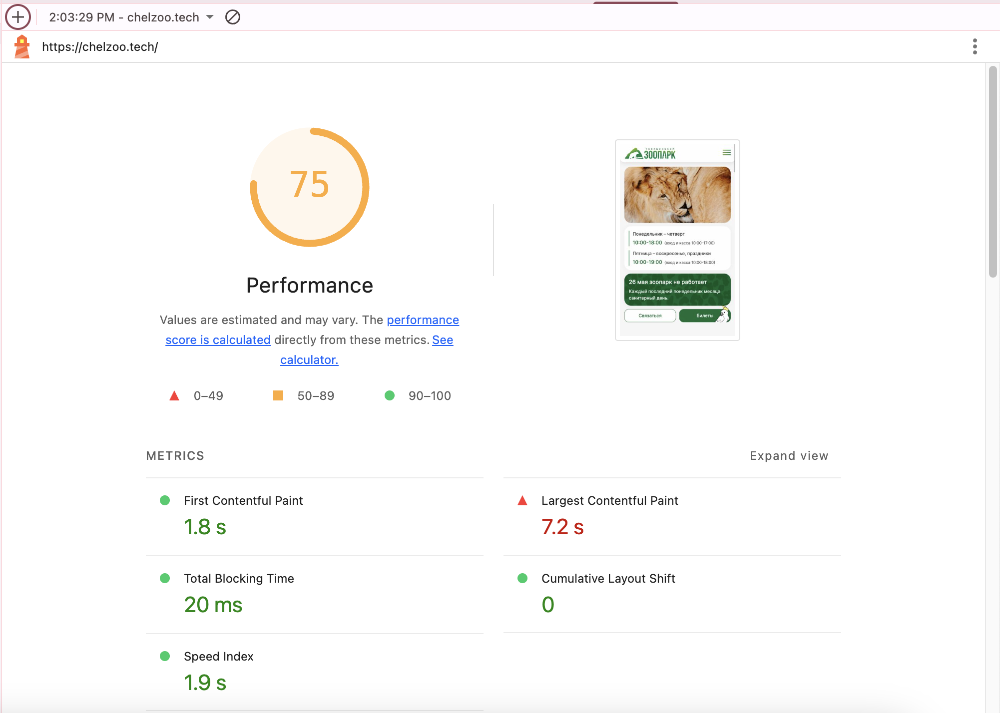
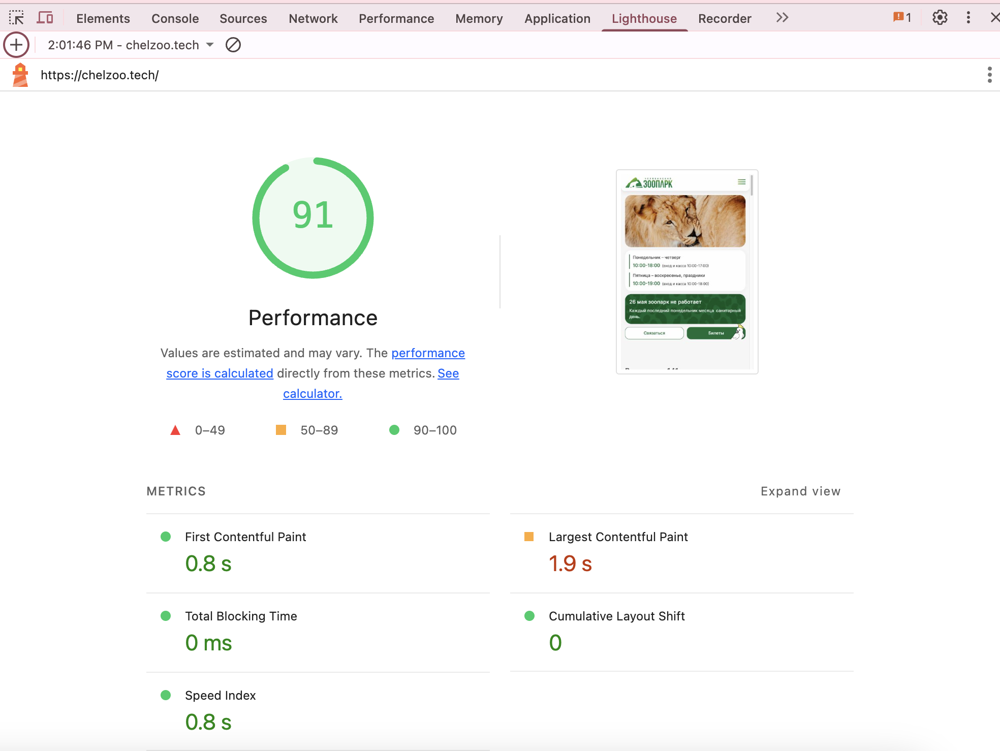

# Шаги по улучшению перфоманса для Next.js

Lighthouse – это полезный инструмент для автоматизированной оценки веб-страниц. Несмотря на свою полезность, он не является абсолютно точным и не должен использоваться как единственное средство оценки качества сайта. Он дает хорошие ориентиры, но не заменяет ручное тестирование и экспертный анализ.

Проверка производительности через вкладку _Lighthouse_ в инструментах разработчика в браузере позволяет увидеть зоны, где можно улучшить показатели производительности.

Вот что мы применили, чтобы улучшить эти показатели:

## 1. Изображения

- Обжали изображения при помощи таких инструментов как https://tinypng.com/ и https://jakearchibald.github.io/svgomg/, чтобы уменьшить их размер без потери качества.

- Проставили параметр [`unoptimized`](https://nextjs.org/docs/pages/api-reference/components/image#unoptimized) для svg-файлов, если они используются в теге [Image](https://nextjs.org/docs/pages/api-reference/components/image), так как Next.js не оптимизирует векторные изображения, и таким образом мы явно говорим ему, чтобы он не тратил на это ресурсы.

- Задали параметр [`priority`](https://nextjs.org/docs/pages/api-reference/components/image#priority) для изображений, которые находятся во вьюпорте при загрузке страницы. Это позволяет приоритизировать загрузку критичных ассетов.

- Для изображений, которые отрисовываются и попадают во вьюпорт только при открытии попапа, задали параметр [`loading="eager"`](https://nextjs.org/docs/pages/api-reference/components/image#loading) вместо заданного по умолчанию [`loading="lazy"`](https://nextjs.org/docs/pages/api-reference/components/image#loading). Это позволяет начать подгрузку таких изображений сразу, как только они появляются в DOM-дереве.

- Для оптимальной загрузки изображений на разных брейкпойнтах задали параметр [`sizes`](https://nextjs.org/docs/pages/api-reference/components/image#sizes) для тех картинок, которые используют параметр [`fill`](https://nextjs.org/docs/pages/api-reference/components/image#fill). Пример:
```
<Image 
    fill 
    src="/example.png"
    sizes={(max-width: 767px) 100vw, (max-width: 1365px) 50vw, 33vw)}
/>
```
Эта запись говорит браузеру: <br/>
"Если вьюпорт меньше или равен 767px, изображение должно занимать 100% ширины вьюпорта."<br/>
"Если ширина вьюпорта между 768px and 1365px, изображение должно занимать 50% ширины вьюпорта."<br/>
"Иначе (для вьюпортов от 1366px), изображение должно занимать 33% ширины вьюпорта."

- Добавили кеширование для картинок, которые оптимизируются, с помощью параметра [minimumCacheTTL](https://nextjs.org/docs/pages/api-reference/components/image#minimumcachettl).

## 2. Скрипты 

- Подключали сторонние скрипты через тег `Script` от Next.js.

- Добавили параметр `strategy='lazyOnLoad'` для скриптов, которые не влияют на загрузку страницы и функциональность, чтобы они подгружались после приоритетного контента.  
Например:
```js
<Script
    id="yandex-metrika"
    strategy="lazyOnload"
    ...
/>
```

## 3. Другое

- Добавили свойство `font-display: swap` для шрифтов. Оно задаёт очень короткий (менее 100 миллисекунд) период блокировки и бесконечный период замены. При такой стратегии браузер практически сразу отображает текст запасным шрифтом, а затем, когда подгружён нужный шрифт, переключается на него.

```js
const inter = localFont({
  src: [
    {
      path: '../../public/fonts/Inter-Regular.woff',
      weight: '400',
      style: 'normal',
    },
  ],
  variable: '--font-inter',
  display: 'swap',
});
```

- Точечно использовали динамические импорты.
Например для баннера госуслуг, который находится внизу страницы и благодаря динамическому импорту отрисовывается после загрузки всех остальных компонентов, которые заданы через статический импорт.
Например: 

```js
const GosBanner = dynamic(
  () => import(`../../home-page/GosBanner/GosBanner`).then((component) => component.GosBanner),
  {
    ssr: true,
  },
);
```

- Для улучшения показателя _Cumulative Layout Shift_, который показывает, насколько сильно элементы страницы смещаются во время ее загрузки, добавили CSS-свойства `min-height: 100vh` для основного контента. 

- Также свою роль сыграло добавление лоадера на страницу, который маскирует возможный сдвиг контента до отрисовки страницы.

## Инструменты для диагностики:
- вкладка **Lighthouse** в инстументах разработчика;
- вкладка **Performance** в инстументах разработчика, подробно как ей пользоваться [тут](https://www.debugbear.com/blog/lcp-request-discovery);
- Сайт [webpagetest](https://www.webpagetest.org/), на котором можно запускать тесты на производительность сайта и получать разные метрики, в частности проверить есть ли у нас какие-то блокирующие скрипты. 

### Полезные статьи:
https://habr.com/ru/companies/fuse8/articles/754684/


Благодаря в том числе этим оптимизациям удалось достичь следующих показателей (на примере главной страницы):<br/>
Мобильная версия
<br/>

Десктопная версия
<br/>
