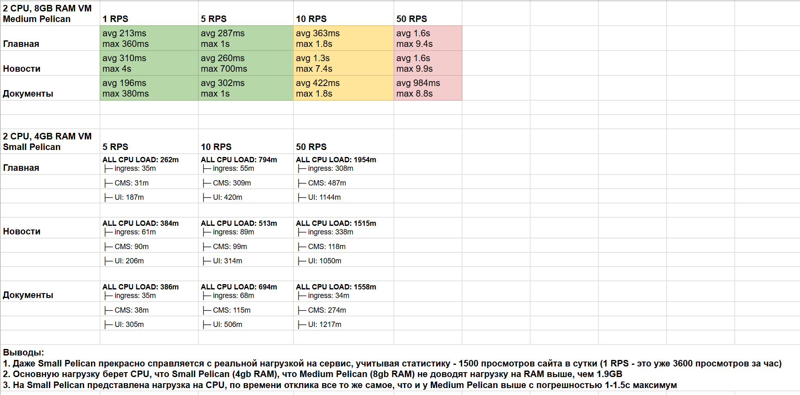

# Нагрузочное тестирование стейджинга Chelzoo.tech

## Инструкция по запуску

### Предусловия
1. Установлен [VSCode](https://code.visualstudio.com/)
2. Установлено расширение [Devcontainers](https://marketplace.visualstudio.com/items?itemName=ms-vscode-remote.remote-containers) в VSCode
3. Установлен и запущен [Docker Desktop](https://www.docker.com/)

### Шаги для запуска
1. Запустите окно VSCode в режиме Devcontainers, нажав на **две стрелочки** в левом нижнем углу вашего окна VSCode, затем **Reopen in Container**

2. Перейдите в файл [/script/loadtest.yml](\script\loadtest.yml)
3. Изучите файл и настройте необходимые вам параметры
4. Запустите терминал, нажав на **Terminal -> New terminal** в левом верхнем углу вашего окна VSCode

5. Пропишите в терминале команду ```stepci run --loadtest ./load-testing/script/loadtest.yml```
6. Дождитесь результата выполнения нагрузочного теста
7. Ознакомьтесь с результатами нагрузочного тестирования

## Интерпретация результатов
###  **response_time** (Время ответа):

- **min**: Самая быстрая загрузка страницы

- **max**: Самая медленная загрузка страницы

- **avg**: Среднее время загрузки

- **med**: Время, быстрее которого загрузились 50% страниц

- **p95**: Время, быстрее которого загрузились 95% страниц

- **p99**: Время, быстрее которого загрузились 99% страниц

### **steps** (Шаги запросов):

- **failed**: Запросы с ошибками

- **passed**: Успешные запросы

- **skipped**: Пропущенные запросы

- **errored**: Запросы с критическими ошибками

- **total**: Всего запросов

### **tests** (Тесты):

- **failed**: Тесты с ошибками

- **passed**: Успешные тесты

- **total**: Всего тестов

- **rps** (Скорость): Среднее количество запросов в секунду

- **iterations** (Повторения): Сколько раз выполнился полный тестовый сценарий

- **duration** (Длительность): Общее время выполнения теста в миллисекундах

### **Workflow passed** (Итог): Общий результат выполнения теста (успех/провал)

## Результаты последнего нагрузочного тестирования

