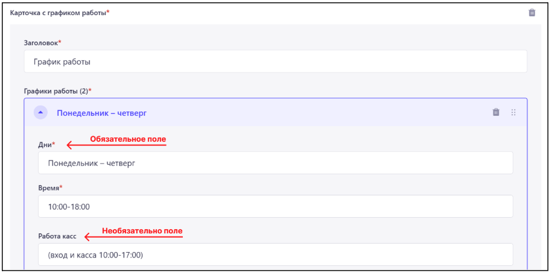

# Инструкция по добавлению, редактированию и удалению контента сайта Челябинского зоопарка через CMS Strapi

1. Ссылки:
Адрес CMS был отправлен на gaussveta@yandex.ru.
Рекомендуется держать адрес страницы CMS в секрете, поскольку несанкционированный доступ к ней может нарушить стабильную работу сайта. CMS будет доступна только из внутренней сети  зоопарка.

2. Авторизация в CMS:
Перед тем, как начать взаимодействие с контентом сайта, необходимо пройти авторизацию в системе управления контентом (далее CMS).

 
*Окно авторизации CMS*

Для прохождения авторизации необходимо:
Указать email в поле 1
Указать пароль в поле 2
Нажать на кнопку 4

Логины и пароли были направлены на электронный почтовый ящик: gaussveta@yandex.ru

В поле 5 можно выбрать язык, на котором будет отображаться интерфейс CMS (Русский/English).

3. Общая информация: 
a. Выход из аккаунта в CMS:

  
*Порядок выхода из аккаунта в CMS*  

b. Черновик и опубликованная версия контента:

Весь контент в CMS имеет черновую версию (Черновик/Draft) и опубликованную версию (Published).
Опубликованная версия видна всем.
Черновую версию можно посмотреть в CMS или в режиме предварительного просмотра.

  
*Переключение между версиями контента* 

Например, заполним компонент “Первый блок” на главной странице и опубликуем её. В разделе “Published” контент будет отображаться следующим образом:

  
*Опубликованная версия главной страницы*  

Далее переключимся на “Draft” версию контента и внесем изменения в поле “Заголовок” в карточке с информацией:

  
*Черновая версия главной страницы*  

В случае, если черновик отличается от опубликованной версии, в поле 1 будет надпись “Modified”.

c. Предварительный просмотр:

При редактировании черновой версии страницы есть возможность предварительно посмотреть на то, как будет выглядеть контент на сайте. На странице черновика в правой части экрана располагается кнопка "Открыть превью черновика", по клику на которую откроется сайт с контентом, который задан в черновой версии страницы.

  
*Кнопка предварительного просмотра страницы*  

При просмотре предварительной версии, в верхней части сайта отображается кнопка “Выйти из режима черновика”, при нажатии на которую режим будет отключен.

  
*Отображение черновой версии главной страницы* 

d. Обязательные поля:

В большинстве блоков  встречаются поля, без заполнения которых нельзя опубликовать контент. Такие поля являются обязательными для заполнения и помечаются  звездочкой.

  
*Обязательные и необязательные поля*

e. Загрузка файлов:

Некоторые блоки имеют поля загрузки медиа контента (видео, изображения или документы):

  
*Поле загрузки файлов* 

Такие поля позволяют загружать один или несколько файлов разных форматов, в зависимости от блока в котором расположено поле.

Поддерживаемые форматы:
Изображения: JPEG, PNG, GIF, SVG, TIFF, ICO, DVU
Видео: MPEG, MP4, Quicktime, WMV, AVI, FLV
Документы: CSV, ZIP, PDF, Excel, DOCX и другие…

Выбор изображения(ий) из ранее загруженных:
Шаг 1. Нажимаем на “+” в поле. 

  
*Поле загрузки изображения/видео* 

Шаг 2. Выбираем нужное изображение, устанавливая галочку в левом верхнем углу самого изображения (либо несколько галочек в случае загрузки нескольких изображений).

  
*Выбор изображения*

Готово. Изображение успешно загружено в поле.

 
*Поле загрузки изображения/видео* 

Загрузка нового изображения(ий).
Шаг 1. Нажимаем на “+” в поле или перетаскиваем файл в зону загрузки (в этом случае сразу переходим к 4 шагу). 

  
*Поле загрузки изображения/видео*

Шаг 2. Нажимаем на кнопку “Добавить ещё ресурсы”.

  
*Промежуточное окно загрузки изображения*

Шаг 3. Нажимаем на кнопку “Обзор файлов”, после этого должно открыться диалоговое окно, где нужно выбрать изображение на вашем компьютере, которое вы хотите загрузить в медиа-библиотеку CMS.

  
*Окно загрузки изображения*

Шаг 4. Будет открыто окно с загруженным изображением.

  
*Окно отображения загруженного изображения*

Если все желаемые изображения загружены, нужно нажать на кнопку 1, иначе на кнопку 2, выбрать дополнительные изображения, а после нажать на кнопку 1 для подтверждения выбора.

Шаг 5. Повторно подтверждаем загрузку выбранного изображения.
  
*Окно подтверждения выбора*

Готово. Изображение успешно загружено в поле.

  
*Поле загрузки изображения/видео*

f. Медиа-библиотека:

В левой части интерфейса CMS доступен раздел “Медиа-библиотека”, в котором отображены все загруженные в CMS файлы. В этом разделе доступна загрузка новых файлов и создание папок, с помощью которых можно группировать загруженные файлы.

  
*Расположение раздела*

Загрузка файлов в этом разделе идентична порядку загрузки через отдельное поле (смотри пункт e. Загрузка файлов). Необходимо нажать на кнопку “+ Add new assets”, которая расположена в верхней части раздела.

  
*Расположение кнопки загрузки файлов*

Для создания папки необходимо нажать на кнопку “+ Add new folder” в верхней части раздела.

  
*Расположение кнопки создания папки*

После нажатия на кнопку откроется всплывающее окно, в котором необходимо указать название будущей папки в поле “Name”.

  
*Всплывающее окно создания папки*

После того, как название было заполнено, нужно нажать на “Create”.

  
*Расположение кнопки*

После этого папка будет создана и отображена в разделе.

  
*Отображение папки*

Если нажать на папку, она откроется. Загрузка файлов в папку идентична порядку загрузки через отдельное поле (смотри пункт e. Загрузка файлов).