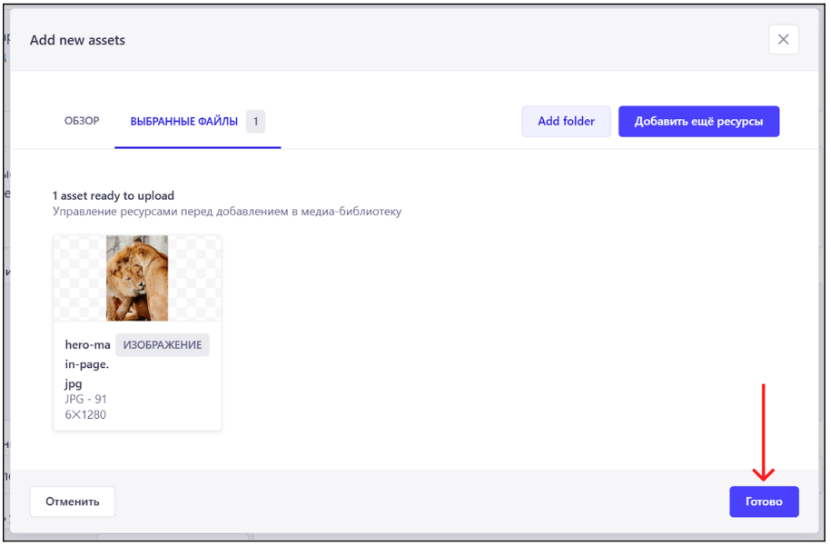
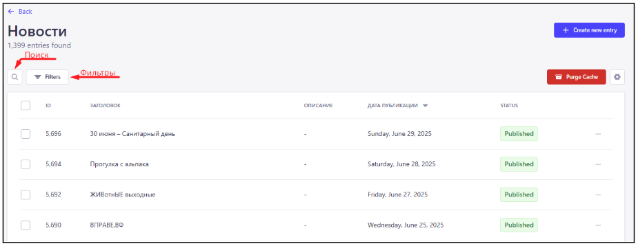
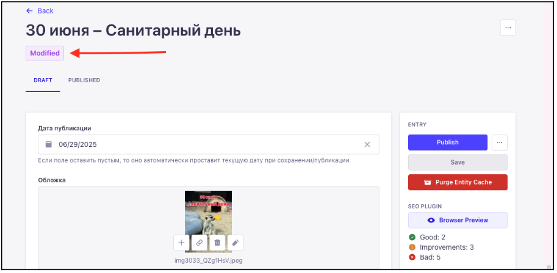
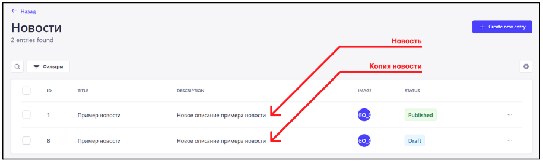

# Инструкция по добавлению, редактированию и удалению контента сайта Челябинского зоопарка через CMS Strapi

1. Ссылки:
Адрес CMS был отправлен на gaussveta@yandex.ru.
Рекомендуется держать адрес страницы CMS в секрете, поскольку несанкционированный доступ к ней может нарушить стабильную работу сайта. CMS будет доступна только из внутренней сети  зоопарка.

2. Авторизация в CMS:
Перед тем, как начать взаимодействие с контентом сайта, необходимо пройти авторизацию в системе управления контентом (далее CMS).

 
*Окно авторизации CMS*

Для прохождения авторизации необходимо:
Указать email в поле 1
Указать пароль в поле 2
Нажать на кнопку 4

Логины и пароли были направлены на электронный почтовый ящик: gaussveta@yandex.ru

В поле 5 можно выбрать язык, на котором будет отображаться интерфейс CMS (Русский/English).

3. Общая информация: 
a. Выход из аккаунта в CMS:

  
*Порядок выхода из аккаунта в CMS*  

b. Черновик и опубликованная версия контента:

Весь контент в CMS имеет черновую версию (Черновик/Draft) и опубликованную версию (Published).
Опубликованная версия видна всем.
Черновую версию можно посмотреть в CMS или в режиме предварительного просмотра.

  
*Переключение между версиями контента* 

Например, заполним компонент “Первый блок” на главной странице и опубликуем её. В разделе “Published” контент будет отображаться следующим образом:

  
*Опубликованная версия главной страницы*  

Далее переключимся на “Draft” версию контента и внесем изменения в поле “Заголовок” в карточке с информацией:

  
*Черновая версия главной страницы*  

В случае, если черновик отличается от опубликованной версии, в поле 1 будет надпись “Modified”.

c. Предварительный просмотр:

При редактировании черновой версии страницы есть возможность предварительно посмотреть на то, как будет выглядеть контент на сайте. На странице черновика в правой части экрана располагается кнопка "Открыть превью черновика", по клику на которую откроется сайт с контентом, который задан в черновой версии страницы.

  
*Кнопка предварительного просмотра страницы*  

При просмотре предварительной версии, в верхней части сайта отображается кнопка “Выйти из режима черновика”, при нажатии на которую режим будет отключен.

  
*Отображение черновой версии главной страницы* 

d. Обязательные поля:

В большинстве блоков  встречаются поля, без заполнения которых нельзя опубликовать контент. Такие поля являются обязательными для заполнения и помечаются  звездочкой.

  
*Обязательные и необязательные поля*

e. Загрузка файлов:

Некоторые блоки имеют поля загрузки медиа контента (видео, изображения или документы):

  
*Поле загрузки файлов* 

Такие поля позволяют загружать один или несколько файлов разных форматов, в зависимости от блока в котором расположено поле.

Поддерживаемые форматы:
Изображения: JPEG, PNG, GIF, SVG, TIFF, ICO, DVU
Видео: MPEG, MP4, Quicktime, WMV, AVI, FLV
Документы: CSV, ZIP, PDF, Excel, DOCX и другие…

Выбор изображения(ий) из ранее загруженных:
Шаг 1. Нажимаем на “+” в поле. 

  
*Поле загрузки изображения/видео* 

Шаг 2. Выбираем нужное изображение, устанавливая галочку в левом верхнем углу самого изображения (либо несколько галочек в случае загрузки нескольких изображений).

  
*Выбор изображения*

Готово. Изображение успешно загружено в поле.

 
*Поле загрузки изображения/видео* 

Загрузка нового изображения(ий).
Шаг 1. Нажимаем на “+” в поле или перетаскиваем файл в зону загрузки (в этом случае сразу переходим к 4 шагу). 

  
*Поле загрузки изображения/видео*

Шаг 2. Нажимаем на кнопку “Добавить ещё ресурсы”.

  
*Промежуточное окно загрузки изображения*

Шаг 3. Нажимаем на кнопку “Обзор файлов”, после этого должно открыться диалоговое окно, где нужно выбрать изображение на вашем компьютере, которое вы хотите загрузить в медиа-библиотеку CMS.

  
*Окно загрузки изображения*

Шаг 4. Будет открыто окно с загруженным изображением.

  
*Окно отображения загруженного изображения*

Если все желаемые изображения загружены, нужно нажать на кнопку 1, иначе на кнопку 2, выбрать дополнительные изображения, а после нажать на кнопку 1 для подтверждения выбора.

Шаг 5. Повторно подтверждаем загрузку выбранного изображения.
  
*Окно подтверждения выбора*

Готово. Изображение успешно загружено в поле.

  
*Поле загрузки изображения/видео*

f. Медиа-библиотека:

В левой части интерфейса CMS доступен раздел “Медиа-библиотека”, в котором отображены все загруженные в CMS файлы. В этом разделе доступна загрузка новых файлов и создание папок, с помощью которых можно группировать загруженные файлы.

  
*Расположение раздела*

Загрузка файлов в этом разделе идентична порядку загрузки через отдельное поле (смотри пункт e. Загрузка файлов). Необходимо нажать на кнопку “+ Add new assets”, которая расположена в верхней части раздела.

  
*Расположение кнопки загрузки файлов*

Для создания папки необходимо нажать на кнопку “+ Add new folder” в верхней части раздела.

  
*Расположение кнопки создания папки*

После нажатия на кнопку откроется всплывающее окно, в котором необходимо указать название будущей папки в поле “Name”.

  
*Всплывающее окно создания папки*

После того, как название было заполнено, нужно нажать на “Create”.

  
*Расположение кнопки*

После этого папка будет создана и отображена в разделе.

  
*Отображение папки*

Если нажать на папку, она откроется. Загрузка файлов в папку идентична порядку загрузки через отдельное поле (смотри пункт e. Загрузка файлов).

g. Списки множественного контента (новости, категории документов, документы)

В подобных общих списках (например, список новостей) присутствует возможность поиска и фильтрации. Соответствующие кнопки выглядят следующим образом.

  
*Расположение кнопок поиска и фильтрации*

Поиск производится по всем полям в таблице.

  
*Пример поиска по новостям*

При нажатии на кнопку “Фильтры” будет открыто всплывающее окно, где доступно несколько опций.
Поле, на которое будем ориентироваться при составлении выборки (например, заголовок).
Условие, по которому будем отбирать подходящие варианты.
Искомое значение, на которое будем ориентироваться при выборке.

  
*Всплывающее окно фильтров*

После того, как условие определено, необходимо нажать на кнопку “Добавить фильтр”.

  
*Расположение кнопки добавления фильтра*

После этого фильтр будет добавлен и применён. Дополнительно появится метка фильтра над списком.

  
*Расположение метки фильтра*

4. Редактирование страниц:
Для редактирования страниц необходимо зайти в раздел “Контент менеджмент” (Content Manager).

  
*Расположение раздела контент менеджмента*

Для редактирования главной страницы выберите “Главная страница” во вкладке “Контент менеджмент (Content Manager)”.

  
*Расположение главной страницы в разделе контент менеджмента*

Главная страница состоит из следующих блоков:
Первый блок
Блок с картинкой/видео
Блок с услугами
Блок с картинкой и кнопкой
Блок с билетами
Блок с картой

Первый блок:

  
*Внешний вид первого блока*

Для редактирования данного блока нужно выбрать “Первый блок”.

  
*Редактирование первого блока*

В развернутой вкладке вы сможете отредактировать необходимые поля для первого блока.

  
*Поля первого блока*

Блок с картинкой/видео:

  
*Внешний вид блока с картинкой/видео*

Для редактирования данного блока необходимо выбрать “Блок с картинкой/видео”.

  
*Редактирование блока с картинкой/видео*

В развернутой вкладке вы сможете отредактировать необходимые поля для блока с картинкой/видео.

  
*Поля блока с картинкой/видео*

Блок с услугами:

  
*Внешний вид блока с услугами*

Для редактирования этого блока нужно выбрать “Блок с услугами”.

  
*Редактирование блока с услугами*

В развернутой вкладке вы сможете отредактировать необходимые поля для блока с услугами.

  
*Поля блока с услугами*

Блок с картинкой и кнопкой:

  
*Внешний вид блока с картинкой и кнопкой*

Для редактирования данного блока необходимо выбрать “Блок с картинкой и кнопкой”.

  
*Внешний вид блока с картинкой и кнопкой*

В развернутой вкладке вы сможете отредактировать необходимые поля для блока с картинкой и кнопкой.

  
*Поля блока с картинкой и кнопкой*

Блок с билетами:

  
*Внешний вид блока с билетами*

Для редактирования этого блока нужно выбрать “Блок с билетами”.

  
*Редактирование блока с билетами*

В развернутой вкладке вы сможете отредактировать необходимые поля для данного блока.

  
*Поля блока с билетами*

Блок с картой: 
 
*Внешний вид блока с картой*

Для редактирования блока с картой нужно выбрать “Блок с картой”.

 
*Редактирование блока с картой*

В развернутой вкладке вы сможете отредактировать необходимые поля для данного блока.

 
*Поля блока с картой*

b. Блок SEO:

Блок SEO не похож на остальные блоки, он присутствует по умолчанию на всех страницах сайта и отвечает за поисковую оптимизацию. Блок располагается в нижней части каждой конкретной страницы или сущности (например, конкретной новости или категории документов).

 
*Блок SEO главной страницы в CMS*

Заголовок страницы, указанный в этом блоке, будет отображен в названии вкладки браузера, а также в поисковой выдаче браузера. Максимальная длина – 300 символов, рекомендуемая – до 60 символов.

 
*Отображение SEO заголовка*

Описание страницы, указанное в этом блоке, будет использовано браузером и отображено под ссылкой на сайт в поисковой выдаче. Минимальная длина составляет 50 символов, максимальная – 1000 символов, рекомендуемая – до 160 символов.

 
*Отображение информации, указанной в блоке SEO*

c. Шапка сайта (всплывающее окно с билетами):

В этом разделе доступно редактирование информации, которая расположена в окне покупки билетов, которое открывается при нажатии на кнопку “Билеты” в шапке, первом блоке и подвале сайта.

 
*Внешний вид всплывающего окна покупки билетов*

 
*Расположение кнопки покупки билетов (шапка сайта)*

 
*Расположение кнопки покупки билетов (первый блок)*

 
*Расположение кнопки покупки билетов (подвал сайта)*

Для редактирования окна с билетами нужно выбрать “Шапка сайта”.

 
*Редактирование всплывающего окна с билетами*

d. Страница контактного зоопарка:

Для редактирования данной страницы необходимо выбрать “Страница контактного зоопарка”.

 
*Редактирование страницы контактного зоопарка*

Чтобы отредактировать контент, нужно кликнуть на нужный блок, чтобы он расхлопнулся, после чего можно редактировать поля.

 
*Блоки страницы контактного зоопарка*

e. Страница правил посещения:

Для редактирования данной страницы необходимо выбрать вкладку “Страница правил посещения” в Content Manager.

 
*Редактирование страницы правил посещения*

 
*Редактируемые блоки на странице правил посещения*

 
*Один из редактируемых блоков в расхлопнутом виде*

Чтобы отредактировать контент, нужно кликнуть на нужный блок, чтобы он расхлопнулся, после чего можно редактировать его поля.

f. Страница льгот:

Для редактирования данной страницы необходимо выбрать “Страница льгот”.

 
*Редактирование страницы льгот*

Чтобы отредактировать контент, нужно кликнуть на нужный блок, чтобы он расхлопнулся, после чего можно редактировать поля.

 
*Блоки страницы льгот*

g. Страница новостей:

Для редактирования страницы новостей необходимо выбрать “Страница новостей”. В данной вкладке можно настроить заголовок для страницы и задать SEO настройки.

 
*Редактирование страницы новостей*

 
*Отображение информации на странице новостей*

h. Страница документов:

Для редактирования страницы документов нужно выбрать вкладку “Страница документов”. В ней можно настроить заголовок страницы и задать SEO настройки.

 
*Редактирование страницы документов*

 
*Отображение информации на странице документов*

i. Добавление, редактирование и удаление новостей:

Для редактирования новостей нужно выбрать раздел “Новости”.

 
*Расположение раздела новостей*

Внутри раздела отображается список всех новостей (если они были ранее добавлены, иначе список будет пуст).

Для того чтобы добавить новость, необходимо нажать на кнопку “+ Create new entry”, которая расположена в правом верхнем углу экрана.

 
*Расположение кнопки создания новости*

После нажатия на кнопку откроется окно создания новости. Заполнив необходимые поля, нужно нажать на кнопку “Сохранить / Save” для того, чтобы сохранить новость в черновике и/или кнопку “Опубликовать / Publish”, чтобы опубликовать новость. В первом случае новость будет доступна только внутри CMS или в режиме предварительного просмотра, во втором случае она отобразится на сайте для всех пользователей.

 
*Расположение кнопок*

После этого созданная новость отобразится в общем списке новостей. 

В правой части карточки новости в общем списке новостей отображается иконка в виде 3 точек, нажатие на которую приведет к открытию окна с несколькими опциями:
Edit - редактировать новость
Duplicate - создать дубликат новости
Delete entry - удалить новость

 
*Отображение окна опций*

При выборе опции “Edit”, будет открыто окно редактирования новости. После внесения изменений нужно нажать на кнопку “Сохранить / Save” в правой части экрана. При этом статус новости будет изменён на “Modified”, что означает, что черновик новости имеет отличия от опубликованной версии.

 
*Сохранение внесённых изменений*

 
*Изменение статуса новости*

Для того, чтобы применить внесенные изменения, нужно нажать на кнопку “Опубликовать / Publish” в правой части экрана.

 
*Опубликование изменённой версии новости*

 
*Изменение статуса новости*

Помимо редактирования новости, можно сделать ее дубликат. Для этого необходимо выбрать опцию “Duplicate”. После нажатия будет создана копия новости, которая отобразится в общем списке новостей.

 
*Отображение копии новости в общем списке новостей*

Чтобы удалить новость, необходимо выбрать опцию “Delete entry”, а после подтвердить удаление новости.

 
*Подтверждение удаления новости*

j. Добавление, редактирование и удаление категорий документов:

Для редактирования категорий документов нужно выбрать раздел “Категории документов”.

 
*Расположение раздела категории документов*

Внутри раздела отображается список всех добавленных категорий документов. Если ранее не была добавлена ни одна категория, то список будет пуст.
Для того чтобы добавить новую категорию, нужно нажать на кнопку “+ Create new entry” в правом верхнем углу экрана.

 
*Расположение кнопки добавления категории*

После нажатия на кнопку откроется окно создания категории. Заполнив необходимые поля, необходимо нажать на кнопку “Сохранить / Save”, чтобы сохранить новость в черновике и/или кнопку “Опубликовать / Publish”, чтобы опубликовать категорию. В первом случае категория будет доступна только внутри CMS или в режиме предварительного просмотра, во втором случае она отобразится на сайте для всех пользователей.

 
*Расположение кнопок*

Для категорий доступна фильтрация по годам в виде табов.

 
*Фильтрация по годам в виде табов в рамках одной категории*

Чтобы табы появились в интерфейсе, нужно при добавлении категории выставить опцию TRUE в соответствующем поле (TRUE выбрано по умолчанию). Там, где разделение по годам не требуется, можно проставить FALSE для этого поля. Поле URL генерируется автоматически, его не нужно заполнять руками.

 
*Поле для включения/выключения фильтрации по годам и поле URL*

После сохранения новая категория отобразится в общем списке и будет доступна при добавлении документа в выпадающем списке. Подробнее про добавление документов в следующем разделе.

 
*Привязка документа к категории при его добавлении*

В правой части карточки категории в общем списке категорий отображается иконка в виде 3 точек, нажав на которую можно открыть окно с несколькими опциями:

Edit - редактировать категорию
Duplicate - создать дубликат категории
Delete entry - удалить категорию

Данные опции работают так же, как при работе с новостями, примеры см. по ссылкам в списке выше.

 
*Отображение окна опций*

Добавление, редактирование и удаление документов:
	
Для редактирования документов необходимо выбрать раздел “Документы”. Прежде чем добавить документ, нужно убедиться, что под него создана соответствующая категория (см. Добавление, редактирование и удаление категорий документов)

 
*Расположение раздела документов*

Внутри раздела отображается список всех документов. Если ни один документ не был добавлен, список будет пуст.

Для того чтобы добавить документ, необходимо нажать на кнопку “+ Create new entry”, которая расположена в правом верхнем углу экрана.

 
*Расположение кнопки создания документа*

После нажатия на кнопку откроется окно создания документа. Заполнив необходимые поля, нужно нажать на кнопку “Сохранить / Save”, чтобы сохранить новость в черновике и/или кнопку “Опубликовать / Publish”, чтобы опубликовать документ. В первом случае документ будет доступен только внутри CMS или в режиме предварительного просмотра, во втором случае он отобразится на сайте для всех пользователей.

 
*Расположение кнопок*

После этого новый документ отобразится в общем списке документов. 

В правой части карточки документа в общем списке документов отображается иконка в виде 3 точек, нажатие на которую приведет к открытию окна с опциями:
Edit - редактировать документ
Duplicate - создать дубликат документа 
Delete entry - удалить документ

Данные опции работают так же, как при работе с новостями, примеры см. по ссылкам выше.

 
*Отображение окна опций*

