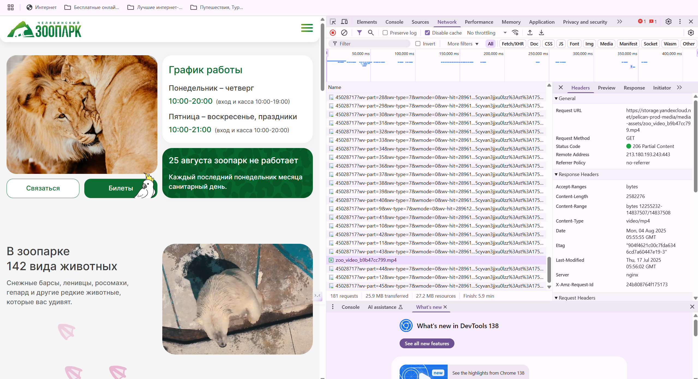
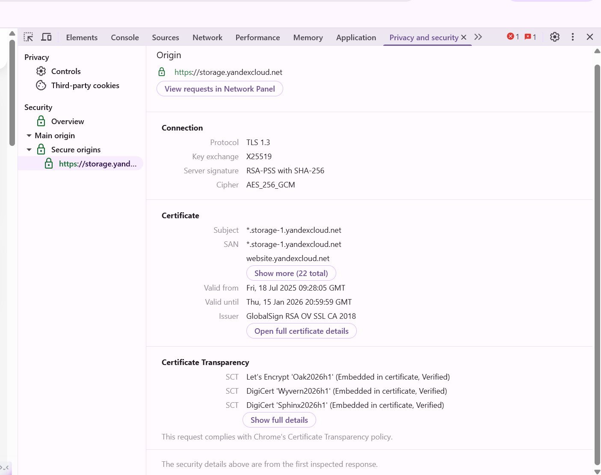
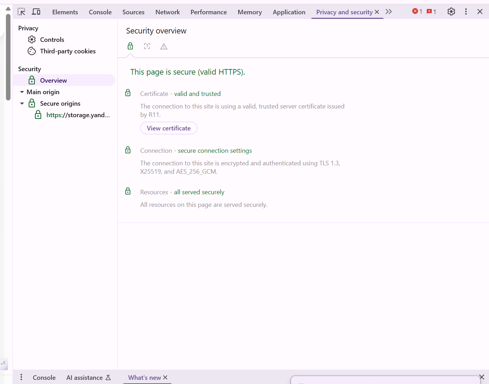
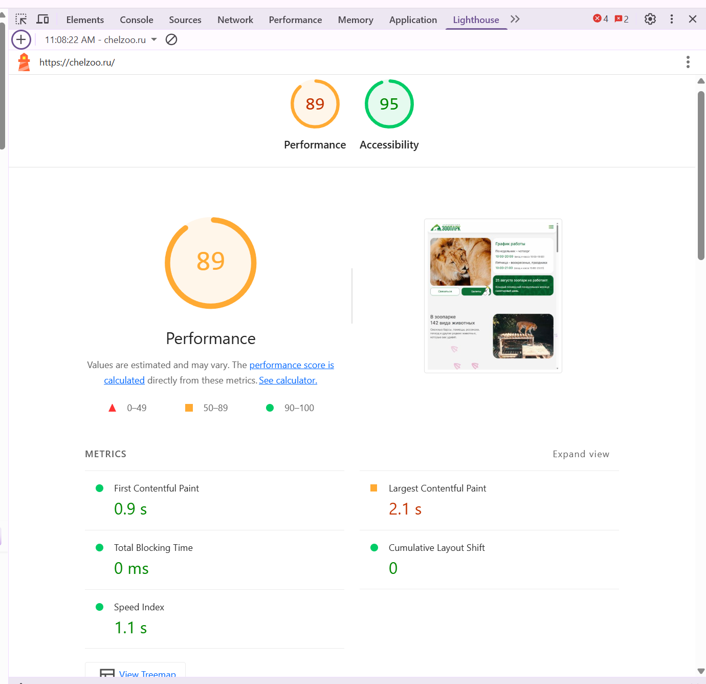

# Test Decision Review Pelican Chelzoo Prod

## Название репозитория:
- *pelican-unfunctional-testing-prod-env*
- *pelican-performance-testing-prod-env*

## Идеи и задачи
1) Выяснить насколько отличается загрузка index.html и прогрузка всех элементов сайта фактически (полная подгрузка видео, иконок и так далее)

2) Покрыть автотестом robots.txt (проверять раз в час или раз в сутки, что он имеет должный вид, toMatch(), если расходится, то тест упал, бьет тревогу и мы в курсе бед)
3) Покрыть автотестом sitemap (E2E UI -> CMS Add New Page -> Publish Page -> Check that page is in the sitemap (has appeared after publishing))
4) Покрыть автотестами бэкапы
5) Переехать на Apache JMeter (лучший и самый востребованный в нагрузочном тестировании, огромное кол-во параметров и прост в использовании сценариев в нашем случае, Open Source, имеет красивые репорты и не багует как StepCI) и валидировать проверки через CLI внутри виртуалки пайплайна или через Taurus по yml файлу
6) Публиковать красивые репорты по нагрузке от jmeter как артефакты
7) Опубликовать в github pages последние репорты по нагрузке и Е2Е в виде красивой html странички
8) Автотест на полную прогрузку страницы с кэшом / без кэша 
кэш + оптимизация, кэш + НЕТ оптимизации, НЕТ кэша + оптимизация, НЕТ КЭША + НЕТ ОПТИМИЗАЦИИ 
9) Автотест на LCP (допустим LCP не дольше 5с), Security (допустим у нас обязательно есть валидный сертификат, originsы секьюрные), A11y не меньше 90 (автотест)
10) Автотест по a11y на конкретно странно оформленную новость (мелкий шрифт, плохой задний вон у шрифта и тд) (посмотреть как отреагирует a11y)
11) 

